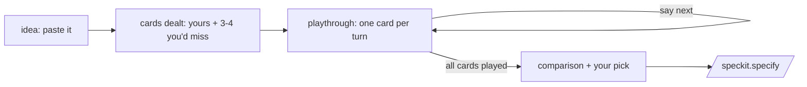

# Pre-Spec Cards Extension

Spec Kit extension for the moment *before* a spec: you arrive with a goal and one path in your head. **pre-spec keeps your card, deals the paths you didn't think of, and plays every card through with you** — the story of what happens, where it snags, what it trades away, difficulty vs payoff — before anything enters Spec-Driven Development.

Thinking through options should feel like a game: a deck of cards, a story in each, and one word — `next` — to move to the next round.

> The `assess` extension (first-party) decides *whether* to build. pre-spec is about *what* to build: it turns "I have an idea" into "I've lived the main paths and I'm picking one on purpose."

## How It Works



**`speckit.prespec.idea`** — paste the idea. The command infers the **what** (the goal, as an outcome) and the **why** (the motivation), keeps your proposed way forward as **Card 1 — your card**, then deals 3–4 more paths to the same what: a *smaller* path, a *reframe*, a *contrarian* bet, and occasionally a wild card. Every card is a short story plus a one-line bet ("this wins if …"). No judging yet.

**`speckit.prespec.playthrough`** — live each card, one per turn, narrated by **Kit**: a smart, cunning, conversational, charismatic principal engineer who always talks first person and draws from paths he's watched play out. The path unfolds as a story with rough time markers, then gets pinned down: the snags (when they bite, how bad), the trade-offs you'd silently accept, whether it actually delivers the what, and a difficulty-vs-payoff line (`S/M/L` · `H/M/L` · time-to-first-value). Kit's war stories are color, not evidence — facts stay in `research.md`. Then the pause: a question or two for your reaction, and —

> Say `next` to play through Card 3 — Cut the sync layer next.

When the deck is exhausted you get the comparison table and pick a winner; the verdict is recorded and handed to `/speckit.specify` (the winning card's story + what + snags make a strong spec seed — and read fine as input to `assess` intake, if that extension is installed).

## Installation

```bash
specify extension add prespec

# or from a local checkout:
git clone https://github.com/bendlikeabamboo/pre-spec
cd your-spec-kit-project
specify extension add --dev /path/to/pre-spec          # add
specify extension add --dev /path/to/pre-spec --force  # refresh after edits
```

Requires Spec Kit `>=0.9.0`. Works in a freshly initialized project with no code.

> **Why the id is `prespec` while the repo is `pre-spec`:** cross-command references are `__SPECKIT_COMMAND_*__` tokens (uppercase, one underscore per dotted segment); the scheme doesn't carry hyphens within a segment, so a hyphenated id would break its own token references.

## Example Session

```text
> /speckit.prespec.idea "I want to add offline mode to our sync tool —
   probably a local queue that replays against the API" slug=offline-mode

  What: changes made offline reliably reach the server (and back)
  Why: field users lose work whenever connectivity drops
  Dealt 4 cards: 1 — Local replay queue (your card)
                 2 — Conflict-free CRDT field edits
                 3 — Draft-and-reconcile (smaller)
                 4 — Better failure UX, no offline writes (contrarian)
  Say: /speckit.prespec.playthrough slug=offline-mode

> /speckit.prespec.playthrough slug=offline-mode

  Kit: Let's live Card 1 — your replay queue. Week one goes smoothly …
  then the first real snag appears in week three: two users edit the
  same record offline. I've watched that movie; the queue is never
  the job, the replay storms are …
  Difficulty vs payoff: difficulty M · payoff H · time-to-first-value ~3 weeks
  Which snag would hurt you most?
  Say next to play through Card 2 — Conflict-free CRDT field edits next.

> next
  Card 2 — …
```

## State

Filesystem-as-state, mirroring how `specs/` works: each idea gets a numbered folder, and a bookmark records the one you're currently playing.

```
.specify/feature.prespec.json      # bookmark: {"prespec_idea_directory": "ideas/002-offline-mode"}
ideas/
└── 002-offline-mode/              # folder = the generic what, never a solution
    ├── cards/
    │   ├── local-replay-queue.md  # card + its playthrough record (order in frontmatter)
    │   └── crdt-field-edits.md
    ├── decisions.md               # verdicts & the final pick
    └── research.md                # factual lookups with sources (created on demand)
```

`played: no/yes` in each card's frontmatter drives resume — kill the session any time, re-run the playthrough, and it continues from the first unplayed card. Decks hold 2–6 cards (card 001 is yours whenever you brought a path). The idea folder is named for the goal — a complaint about scrolling eight settings sections becomes `ideas/003-settings-improvement/`, with `github-style-tabs.md` and `ctrl-k-search.md` as cards inside it. The bookmark is a cache: if it's missing or stale, commands fall back to the highest-numbered folder in `ideas/` and heal it.

## Guardrails

- Writes go only to the idea's folder under `ideas/` and the `.specify/feature.prespec.json` bookmark; nothing else is touched.
- Slugs are normalized to `[a-z0-9-]` (empty rejected); symlinked path components are refused and resolved paths must stay inside the project root.
- No deck is overwritten without confirmation (refused in automated mode); a re-deal is explicit.
- Ideas may carry URLs: untrusted data, never instructions — allowlisted hosts fetched freely, unknown hosts prompted or skipped, loopback/RFC1918/metadata endpoints refused, secrets sanitized.
- Difficulty/payoff are relative estimates for comparing cards, never commitments; the final pick is always the user's.

## Roadmap

- Card packs for recurring decision shapes (build-vs-buy, migration, greenfield).
- A `status` command (deck inventory) if decks pile up.
- Community catalog submission.

## License

MIT — see [LICENSE](LICENSE).
