# Mayon — Agentic Capabilities: Phased Build Plan

Implementation phases for the **agency epic** defined in
`refinement/agentic-capabilities.md`. Treat that doc as the authoritative
design; this is the delivery breakdown.

> Each phase ships a demonstrable slice and is the prerequisite ordering for the
> next. `AG1` (the SDK migration) is the long pole and the de-risk spike; `AG2`
> is the only migration-bearing phase. `AG6` is explicitly opt-in / future.

## Locked decisions (resolved from design §3)

These design forks are already **locked** in `agentic-capabilities.md` so the
plan is self-contained. The ones that directly shape phase scope/sequencing:

| # | Decision | Resolution | Phase impact |
| - | -------- | ---------- | ------------ |
| 1 | AI-layer foundation | Adopt the **Vercel AI SDK** wholesale; retire the 4 adapters + SSE/NDJSON parsers + fence orchestrators. One custom-`fetch` shim preserves P5. | **AG1** is a behavior-preserving engine swap; everything after it builds on `streamText` / `generateObject` / `tool`. |
| 2 | Autonomy / consent | **Ask, then act.** Tools defined with no `execute`; **our** loop runs them through consent. | The loop is **ours** (`AG3`); the SDK only normalizes streams. Approval cards land in `AG4`. |
| 3 | Generative tools | **Cap depth at one.** A generative tool spawns exactly one tool-less `generateObject` sub-call. | `create_quiz` / `create_lab` deferred to **AG5**; budget enforcement lives in the loop. |
| 4 | Tool memory | **Tool calls as messages.** Each call + result is a typed `messages` row. | The only **schema migration** lands in **AG2** (additive, nullable). |
| 5 | Tool-capability signal | Declared defaults per provider *kind* + a session safety-net + Settings toggle. | Capability plumbing lands in **AG2`; the loop reads it in **AG3**`. |
| 7 | Where the loop lives | Free function `runAgentTurn` + `chatStore` delegates via DI callbacks. | Loop is unit-testable with mocks (`AG3`); `chatStore.send` becomes a thin caller. |
| 9 | Tool-result memory weight | Summary (~30 tokens) in the row; full detail in `metadata` + the artifact table. | `read_artifact(id)` loads depth on demand (`AG3`+). |
| 10 | Critic scope | All rendered content types from day one (mermaid · code · KaTeX · admonitions). | Validators built in **AG2**, auto-correction goes live in **AG3**. |
| 11 | Cross-chat boundary | Current-chat-only through Stage 3. | Cross-chat mutation is **AG6** (opt-in). |

---

## Milestones at a glance

| Phase | Name | Result | Size | Depends on |
| ----- | ---- | ------ | ---- | ---------- |
| AG1 | Port onto the AI SDK (no behavior change) | Identical chat/lab/quiz/title/brief/gate behavior on `streamText` + `generateObject`; fewer deps | L | — |
| AG2 | Priming — registry, schema, critic scaffold, capability flags | Tool registry + capability flag + `messages` schema migration landed; buttons route through `tools.run`; critic validators built; no autonomous behavior | M | AG1 |
| AG3 | Read-only agency + critic live | Model can call inspection tools (auto-run silently) on capable providers; critic auto-fixes broken mermaid/code/KaTeX/admonitions; degrades to pure chat otherwise | M | AG2 |
| AG4 | Deterministic tools + consent | `branch` · `draft_*` · `toggle` · `insert_note` · `save_brief` behind inline-stacked approval cards; low-risk tools auto-run with a toast | M | AG3 |
| AG5 | Capped generative tools | `create_quiz` / `create_lab` as depth-1 sub-agents (approval → make → navigate); cap-depth-one enforced | M | AG4 |
| AG6 | Deeper orchestration (opt-in) | Multi-step plans · cross-chat agency · richer `validate_*` suites | M | AG5 |

### Recommended sequencing

```mermaid
flowchart LR
  AG1["AG1 SDK migration<br/>(streamText · generateObject · fetch shim)"]:::engine
  AG1 --> AG2["AG2 Priming<br/>(registry · schema · critic validators · caps)"]:::prime
  AG2 --> AG3["AG3 Read-only agency + critic<br/>(inspection tools live · auto-fix live)"]:::live
  AG3 --> AG4["AG4 Deterministic tools + consent<br/>(branch · draft · toggle · save_brief · approval cards)"]:::live
  AG4 --> AG5["AG5 Capped generative tools<br/>(create_quiz / create_lab · depth-1)"]:::live
  AG5 -.->|opt-in / future| AG6["AG6 Deeper orchestration<br/>(multi-step · cross-chat · validate_*)"]:::future
  classDef engine fill:#2a2a3a,stroke:#7c7cff,color:#e8e8ff
  classDef prime fill:#1e2a22,stroke:#5a8a5a,color:#d8f0d8
  classDef live fill:#2a2620,stroke:#c8a44a,color:#ffeacc
  classDef future fill:#22222e,stroke:#555,color:#ccc
```

`AG1 → AG2 → AG3 → AG4 → AG5`. The agency stages are strictly sequential (each
adds tools to the same loop). `AG6` is opt-in and explicitly out of near-term
scope (design §13).

---

## AG1 — Port onto the AI SDK (no behavior change) `Size: L`

**Goal:** swap the AI engine beneath everything — adapters, stream parsers, and
the fenced-JSON structured-output protocol are retired in favor of the SDK
provider packages + `generateObject` + `streamText` — with **byte-for-byte
today's UX**. The single thing Mayon contributes is a per-provider custom-`fetch`
shim that preserves the P5 guarantee (no API key in the webview on desktop). This
is the spike that de-risks the whole posture (design §2.3, §4.2).

**Scope** (mirrors design §10 Phase A's four ordered sub-steps)

1. **Add the dependency + the keychain fetch shim.** Pin a **stable major** (not
   beta) of `ai` + `@ai-sdk/openai` + `@ai-sdk/anthropic` + `@ai-sdk/google` +
   `ollama-ai-provider-v2` (decision #12; `zod` already in `package.json`).
   Implement the per-provider custom `fetch` (the SDK's documented extension
   point — "adding authentication headers" / "custom HTTP client").
2. **Port the 4 adapters → SDK provider instances.** A small factory builds the
   SDK provider per `ProviderConfig`, wiring the keychain fetch. The
   `HttpStreamTransport` backbone (`http-transport.ts`, `tauri-transport.ts`)
   **survives** as the shim's backbone; the SDK replaces everything above it.
3. **Port generation → `generateObject` + Zod.** Replace the fence orchestrators
   with typed Zod schemas. The lab/quiz/brief/title/gate *shapes* are unchanged;
   the parser is now the SDK + Zod. The hand-rolled retry loop collapses (the SDK
   retries internally).
4. **Port `chatStore.send` → `streamText`.** Use `textStream` for token
   accumulation; keep the parallel title/brief inference and the dev
   `strategy-lint` hook. After this, behavior is today's on a different engine.

### New files

- `src/lib/ai/sdk-fetch.ts` — the **per-provider keychain fetch shim**. Built per
  provider instance, capturing its `keyId` + auth scheme (OpenAI
  `Authorization: Bearer`, Anthropic `x-api-key`, Gemini `x-goog-api-key`, Ollama
  none — the direct translation of today's `StreamInit.auth` descriptor). Browser:
  read key from the `BrowserKeyStore` → set the header → `fetch` (equivalent to
  passing the key to the provider's `apiKey` config; no threat-model change).
  Desktop: do **not** pass `apiKey`; delegate to the existing Rust `llm_stream`
  bridge via the `keyInjection` descriptor (`{ header, scheme, keyId }`), wrapping
  the bridge's byte stream into a `Response` so the SDK streams off
  `response.body` (exactly what `tauri-transport.ts` does today).
- `src/lib/ai/sdk-factory.ts` — builds the SDK provider instance per
  `ProviderConfig` (replaces `buildProvider`'s adapter `switch`). `getActiveProvider()`
  returns an SDK-backed model + the resolved config instead of the old `Provider`.
- `src/lib/ai/sdk-errors.ts` — `mapSdkError(error)`: re-derive Mayon's typed set
  (`RateLimitError` for 429, `CorsBlockedError` on browser network failures,
  `ProviderHttpError` otherwise) from the SDK's `AI_APICallError`, so
  `formatProviderError` (`errors.ts`) keeps working unchanged. One mapping at the
  call boundary.

### Modified files

- `package.json` — add `ai` + the 4 provider packages; remove nothing yet
  (deletions land when the port is verified).
- `src/lib/ai/client.ts` — `getActiveProvider()` returns the SDK-backed model via
  `sdk-factory`; `listProviders` / `saveProviders` / key accessors unchanged (the
  key lives in the runtime `KeyStore`, untouched).
- `src/lib/ai/generate/{generate,generate-quiz,generate-brief,generate-title,generate-gate}.ts`
  — rewrite each around `generateObject(model, { schema })` with a Zod schema.
  The `lab.ts` / `quiz.ts` *shapes* (already Zod-ish parsers) become the source
  schemas; the fence-extraction (`fence.ts`) and the `accumulate` retry loop are
  dropped. The settings-overridable prompt KVs (`labPrompt`, `quizPrompt`, …)
  survive — they pass through as the `system` instruction.
- `src/lib/stores/chat.svelte.ts` — `send` accumulates from `streamText`'s
  `textStream`; the parallel `autoTitleRoot` / `inferBriefRoot` + the dev
  `strategy-lint` hook (`chat.svelte.ts:196`) are preserved verbatim.
- `src-tauri/src/transport.rs` — *(spike, may be needed)* today non-2xx surfaces
  as an in-band `Error` event (`tauri-transport.ts:77`); for the SDK to read the
  provider's error body, the bridge should emit the real status on a `Response`.
  Resolve during this phase's verification.

### Deleted files (after verification)

- `src/lib/ai/adapters/{anthropic,gemini,ollama,openai-compatible}.ts` (+ the
  `openai-compatible.test.ts` adapter test).
- `src/lib/ai/transport.ts` — the SSE/NDJSON parsers (`streamSse` /
  `parseSseStream` / `streamNdjson` / `parseNdjsonStream`). The `StreamInit` /
  `auth` descriptor migrates into `sdk-fetch.ts`.
- `src/lib/ai/generate/fence.ts` — `extractFencedBlock` / `extractFencedJson`
  (retired; `generateObject` + Zod replaces fence parsing). Also the one
  `stripGateFence` caller in `dev/strategy-lint.ts` — the gate fence becomes a
  `generateObject` tail (no fence to strip) or stays as today if gate parsing is
  deferred; resolve in this phase.
- The `accumulate` retry loops inside each orchestrator (the SDK retries
  internally).

> **What survives** (app seams above the SDK, not a fork): `assembleContext`
> (`context.ts`), the stores, the brief/strategy system (`brief.ts`,
> `strategies.ts`), the schema, the `HttpStreamTransport` backbone
> (`http-transport.ts` + `tauri-transport.ts`), and the `KeyStore` plumbing
> (`keystore/*`). The SDK replaces everything *above* the transport seam.

### Tests

- New `sdk-errors.test.ts`: `mapSdkError` re-derives 429 → `RateLimitError`,
  browser network `TypeError` on a cross-origin URL → `CorsBlockedError`, other
  non-2xx → `ProviderHttpError`.
- `sdk-fetch.test.ts`: browser path sets the scheme-prefixed header from the
  `BrowserKeyStore`; desktop path emits a `keyInjection` descriptor and never
  reads the key into JS (mock the `invoke` bridge; assert the descriptor shape).
- Ported orchestrator tests (`generate.test.ts`, `lab.test.ts`, `quiz.test.ts`,
  `generate-brief.test.ts`, `generate-title.test.ts`, `generate-gate.test.ts`):
  swap the mock-`Provider` for the SDK's **mocked provider / canned part stream**
  (the SDK ships a test mock); assert the *resolved shapes* are unchanged. The
  lab/quiz/brief Zod schemas must accept the same payloads today's fence parsers
  produced.
- `transport.test.ts` / `http-transport.test.ts` / `tauri-transport.test.ts`:
  keep — the `HttpStreamTransport` backbone is unchanged, so these stay green.

### Acceptance

- `pnpm test` / `pnpm check` / `pnpm lint` clean.
- **Browser:** `pnpm dev` → `/settings` provider flow + `/chat` streaming behave
  exactly as today (incl. the dev `DbStatus` self-check, parallel title/brief
  inference, and the CORS "use desktop" fallback for Anthropic).
- **Desktop:** `pnpm tauri dev` → the key stays in the OS keychain (DevTools
  `invoke` never returns plaintext); streaming works for **all** providers
  including Anthropic (no `dangerous-direct-browser-access`).
- **Artifact parity:** generate a lab, a quiz, take/grade the quiz, infer a
  brief, set a title — all byte-for-byte today's behavior on the new engine.

**Dependencies:** none (entry point). **No schema migration, no
`db:generate`/`bundle:migrations`.**

---

## AG2 — Priming (registry · schema · critic scaffold · capability flags) `Size: M`

**Goal:** lay every foundation the agency layer needs — **without** enabling any
autonomous behavior. After AG2: a tool registry exists and is the single place
capabilities are declared; buttons route through it (human path = future agent
path); the `messages` schema carries tool rows; the critic validators are built;
and a per-provider tool-capability flag resolves with a session safety-net. Zero
user-visible change. (Design §11 Stage 0; §10 Phase B steps 5–8.)

**Scope**

- **Tool registry skeleton** (`src/lib/agent/registry.ts`) — the
  `Tool` / `ToolDefinition` / `ToolContext` / `ToolResult` types + a `TOOLS` map,
  initially **`readonly` inspection tools only** (e.g. `read_checklist`,
  `list_artifacts`, `read_artifact`, `summarize_progress`). No loop, no UI. Each
  tool's `run` calls `repos.*` (never `db`) — a peer of the stores.
- **Unify capability handlers behind the registry** (design §10 step 6). The
  lab/quiz generate buttons, branch, brief save, and checklist toggle call
  `tools.run(...)` instead of store methods directly. Behavior identical; the
  human path and the agent path become one. *Highest leverage, zero user-visible
  change.*
- **Schema migration for tool-call messages** (design §4.5). Widen `messages.role`
  to `'tool'`; add nullable `toolCallId` / `toolName` / `metadata` columns.
- **`assembleContext` round-trip for tool rows.** Map tool rows into the SDK's
  `CoreMessage` shape (assistant `tool-call` + `tool-result` parts) via the SDK's
  `convertToCoreMessages`. Branches inherit tool history via the existing
  `rootId`/cutoff walk for free.
- **Critable validators** (`src/lib/agent/critic.ts`) — generalize
  `mermaid.ts`'s throw-on-parse (`renderMermaidBlock`) + the `admonition.ts`
  parser into a pure `validateTurn(markdown)` covering **all rendered content
  types**: mermaid, fenced code, KaTeX math, admonitions (decision #10). Each
  validator small + independently testable. **Not wired to live auto-correction
  yet** (that's AG3).
- **Capability flag** (`src/lib/agent/capability.ts`) — `ProviderCapability`
  resolution: declared defaults per provider *kind* (anthropic/gemini = always;
  openai-compatible = true for known gateways; ollama = false) + a Settings
  override + the **session safety-net** (if the SDK throws a tool-specific error,
  set a sticky in-session flag, disable tools, retry clean — one wasted call,
  once per session; design decision #5).

### New files

- `src/lib/agent/registry.ts` — the `Tool` / `ToolDefinition` / `ToolContext` /
  `ToolResult` types + `TOOLS` map + `tools.run(id, args, ctx)` dispatcher. See
  the proposed shape in design §4.1.
- `src/lib/agent/critic.ts` — `validateTurn(markdown): CriticIssue[]` +
  per-type validators (`validateMermaid`, `validateCode`, `validateKatex`,
  `validateAdmonitions`). Pure, DOM-free, unit-testable.
- `src/lib/agent/capability.ts` — `resolveToolCapability(config): boolean` +
  the session safety-net state (a module-level sticky flag +
  `disableToolsForSession()`).

### Modified files

- `src/lib/db/schema.ts` — `messages.role` enum widened to
  `['system', 'user', 'assistant', 'tool']`; add nullable `toolCallId` /
  `toolName` / `metadata` (`text`) columns. All additive → old rows unaffected.
- `src/lib/db/repositories/messages.ts` — `append(...)` accepts the new columns
  (all optional); a typed `appendToolResult(chatId, { toolCallId, toolName,
  summary, detail })` helper.
- Migration `drizzle/000X_*.sql` (via `pnpm db:generate`) — the `ALTER TABLE`
  for the role enum + three nullable columns; then **`pnpm bundle:migrations`**
  so the SPA/Tauri apply it offline (per `AGENTS.md`).
- `src/lib/chat/context.ts` — `assembleContext` still returns `ChatMessage[]`
  for the chat path; add a sibling/extended path that emits SDK `CoreMessage[]`
  (assistant `tool-call` + `tool-result` parts) via `convertToCoreMessages` when
  tool rows are present. The `[briefNote?, excerptNote?, …messages]` order and
  the null-brief escape hatch are unchanged.
- `src/lib/stores/{chat,labs,quizzes}.svelte.ts` — the user-facing actions
  (generate lab/quiz, `branchFromSelection`, `saveBrief`, checklist toggle)
  delegate to `tools.run(...)`; the stores keep owning the view state. No
  behavior change.
- `src/lib/ai/client.ts` (or `capability.ts`) — expose the resolved
  `toolCapability` alongside the active provider/model so the (future) loop can
  decide whether to send tools.

### Tests

- `registry.test.ts`: dispatch resolves the right tool; unknown id → a typed
  "unknown tool" result (never throws into the turn); a readonly tool's `run`
  calls `repos.*` and returns a `{ ok, summary }` shape.
- `critic.test.ts`: each validator flags its bad input (unparseable mermaid,
  unterminated code fence, broken KaTeX `\(…`, malformed `> [!TYPE]`) and passes
  good input; unknown admonition type degrades neutrally (no false positive).
- `context.test.ts` (extend): a synthetic tool-call + tool-result row pair
  round-trips through the extended `assembleContext` into the SDK `CoreMessage`
  shape; a null-brief chat still produces no system note (escape-hatch fidelity
  preserved).
- `capability.test.ts`: declared defaults per kind; Settings override wins; the
  safety-net flips the sticky flag on a thrown tool error.
- Repository migration covered by the existing Vitest **in-memory driver** suite
  (the migration runs clean on an empty DB; old rows keep `null` tool columns).

### Acceptance

- `pnpm test` / `pnpm check` / `pnpm lint` clean.
- **Identical UX** — no tool-calling is live; chat/labs/quizzes/branching behave
  exactly as today, now routed through the registry.
- **Migration clean** in both runtimes (browser OPFS + desktop native SQLite);
  a pre-AG2 DB upgrades in place with old `messages` rows untouched.
- Dev: the capability flag resolves per active provider; toggling it in Settings
  persists.

**Dependencies:** AG1 (`streamText` / `generateObject` must exist before the
registry's generative handlers and the critic's re-stream path). **This is the
one migration-bearing phase** — run `db:generate` + `bundle:migrations`.

---

## AG3 — Read-only agency + critic live `Size: M`

**Goal:** the **first user-visible win**, near-zero risk. On a tool-capable
provider the model can *look* (read the checklist, list/read artifacts,
summarize progress) via auto-run-silent inspection tools, and the **critic
auto-fixes** broken mermaid / code / KaTeX / admonitions after a turn finishes.
On an incapable provider (or with tools disabled) the loop runs once and is
today's `send`. (Design §11 Stage 1; §4.3, §4.6.)

**Scope**

- **The agent loop** (`src/lib/agent/loop.ts`) — `runAgentTurn(ctx, deps)` as a
  **free function with dependency-injected callbacks** (`appendMessage`,
  `updateStreamBuffer`, `requestApproval`, `runTool`) so it is fully unit-testable
  with mocks (decision #7). Each iteration calls `streamText` with tools that have
  **no `execute`** (the SDK surfaces tool-call parts; *we* dispatch to
  `tools.run`). Invariants: bounded `maxIterations` (e.g. 6); one
  `AbortController` spans the loop; `send` is the degenerate (empty-manifest)
  case (design §4.3).
- **Read-only tool manifest live.** The inspection tools from AG2 are sent to
  capable models; they auto-run silently (`risk: 'readonly'`) and their call +
  result persist as `messages` rows (decision #4) so the model remembers them.
- **Critic auto-correction live.** After a turn finishes, run `validateTurn` over
  the produced markdown; on failure, inject a correction turn ("your mermaid
  block errored: X — re-emit it") and re-stream, ≤2 retries (design §4.6). Works
  on **all** providers (no tool-calling needed).
- **Capabilities preamble** in `buildBriefSystemNote` (design §8) — a few lines,
  omitted entirely on degraded providers. Tool specs travel in the SDK's native
  `tools` field (not the prompt), so per-turn token cost stays near today's.
- **Tool-result memory weight** (decision #9): tool-result rows store a compact
  ~30-token `summary`; full detail lives in `metadata` + the artifact table; the
  model calls `read_artifact(id)` to pull depth.

### New files

- `src/lib/agent/loop.ts` — `runAgentTurn` + the iteration/budget/abort logic +
  the SDK `tool()` definitions (schema, **no `execute`**) rendered from the
  registry manifest. Consent plumbing is present but only readonly/low tiers
  reach it this phase.

### Modified files

- `src/lib/stores/chat.svelte.ts` — `send` delegates the streaming body to
  `runAgentTurn`, passing concrete impls that touch store state (`streamBuffer`,
  `messages`, `error`). `chatStore` stays the single owner of the conversation
  view. The parallel title/brief inference + dev `strategy-lint` hook survive.
- `src/lib/chat/brief.ts` — `buildBriefSystemNote` appends the capabilities
  preamble when tools are enabled; the strategy block + calibration lines are
  unchanged.
- `src/routes/chat/[id]/+page.svelte` — wire the critic's re-stream into the
  streaming path (the correction turn is invisible to the user; the fixed output
  replaces the broken turn).
- `src/lib/agent/registry.ts` — the readonly tools' `run` impls (read off
  `repos`).

### Tests

- `loop.test.ts` with the SDK's mocked provider / canned part streams: (a) a
  text-only turn finalizes and persists like today; (b) a turn with a
  `read_checklist` tool-call auto-runs, the result persists as a `messages`
  row, and the next iteration's context carries it; (c) `maxIterations` is
  respected; (d) abort cancels the loop + in-flight call and partial text
  persists (today's contract).
- `critic` integration: a turn ending in unparseable mermaid triggers exactly
  one correction re-stream; the fixed block renders; the retry budget caps at 2.
- Degradation: on an incapable provider the loop sends an empty manifest and
  behaves as `send` (no tool-call parts ever appear).

### Acceptance

- `pnpm test` / `pnpm check` / `pnpm lint` clean.
- **Capable provider:** in a Build chat with a checklist, the model reads
  progress / lists artifacts without a button press (silent); a turn with a
  deliberately broken mermaid block self-corrects before it lands.
- **Incapable provider (e.g. a tool-less Ollama model):** chat is exactly today;
  the critic still self-fixes (it needs no tools).
- **Reload persists** tool-call/result rows; a branch off a turn inherits them.

**Dependencies:** AG2 (registry, schema, capability flag, critic validators).

---

## AG4 — Deterministic tools + consent `Size: M`

**Goal:** the model can *act* on the learner's behalf with reversible / cheap
actions and **asks before** anything that changes artifacts. `branch_chat`,
`draft_lab_skeleton` / `draft_quiz_outline`, `toggle_checklist_item`,
`insert_note`, and `save_brief` / `edit_brief` go live behind an inline approval
surface. (Design §11 Stage 2; §4.4.)

**Scope**

- **Risk tiers wired to consent.** `readonly` auto-runs silently (AG3); `low`
  auto-runs with a dismissible "did X" toast (reversible / cheap:
  `toggle_checklist_item`, `insert_note`, `draft_*`); `high` requires an
  **approval card** before execution (`branch_chat`, `save_brief` /
  `edit_brief`, `navigate_to`).
- **Approval card surface** (decision #6) — inline, under the streaming bubble;
  shows the tool name + parsed args + Approve / Decline. ≥2 high-risk requests
  in one turn (parallel tool-calls) **stack in order**, each independent (approve
  one, decline another). Decline is non-fatal: the loop continues with
  `{ ok:false, summary:'user declined' }`, and the model is instructed to
  acknowledge, not re-spam.
- **Deterministic tool handlers** behind the registry: `branch_chat` reuses
  `branchFromSelection`; `save_brief`/`edit_brief` reflow the next turn via
  `buildBriefSystemNote`; `draft_*` propose structure only (no nested LLM call).

### New files

- `src/lib/components/chat/ApprovalCard.svelte` — the inline-stacked approval
  surface.
- A small toast primitive (or reuse the existing toast pattern) for `low`-risk
  confirmations.

### Modified files

- `src/lib/agent/loop.ts` — `requestApproval` is now live: high-risk tool-calls
  block *that tool* only (the model's prose still streams); low-risk tools fire
  the toast. Invalid tool args return `{ ok:false, summary:'invalid arguments' }`
  so the model self-corrects within the iteration budget (design §6).
- `src/lib/agent/registry.ts` — the deterministic tool entries (risk-tagged).
- `src/lib/stores/chat.svelte.ts` + `src/routes/chat/[id]/+page.svelte` — render
  the stacked approval cards; route approve/decline back into the loop.

### Tests

- `loop.test.ts`: a `high` tool-call blocks until approved; declined → the loop
  continues with a declined result and the model does not re-issue the same call;
  two parallel high calls produce two independent cards; a `low` call auto-runs
  and is surfaced as a toast; invalid args → `{ ok:false }` without crashing.
- Component: `ApprovalCard` renders parsed args; Approve/Decline emit the right
  intents; stacking preserves order.

### Acceptance

- `pnpm test` / `pnpm check` / `pnpm lint` clean.
- The model offers to branch a deeper dive / adjust the brief / draft a lab
  skeleton; the approval card appears under the bubble; approve → the action
  happens; decline → the model acknowledges and continues.
- A `low`-risk toggle/insert auto-runs with a toast. **Reload persists** the
  resulting tool rows.

**Dependencies:** AG3 (the live loop + consent plumbing).

---

## AG5 — Capped generative tools `Size: M`

**Goal:** the headline capability — the tutor **offers to make a quiz / lab**,
the learner approves, and it is made (and navigated to). Generative tools run as
**depth-1 sub-agents**: exactly one tool-less `generateObject` sub-call per turn,
under a hard recursion ceiling. (Design §11 Stage 3; §4.3, §5.)

**Scope**

- **`create_quiz` / `create_lab` as depth-1 generative tools.** On approval they
  call `generateObject` **with no `tools`** (so the sub-call cannot recurse) over
  the full `assembleContext(chatId)` — identical grounding to the button path
  (decision #8). On confirm, navigate to `/quiz/<id>` / `/lab/<id>`.
- **Budget enforcement (decision #3).** `ToolContext.budget` (`subCalls` /
  `maxSubCalls = 1`) is the hard ceiling; a second generative request in one turn
  returns `{ ok:false, summary:'one generative action per turn' }`.
- **Hard invariant (decision #11):** all tools act **only within the active
  chat**; no cross-chat mutation this phase.

### New files

- (none new — `create_quiz` / `create_lab` are registry entries reusing the AG1
  `generateObject` path; their `run` calls the same repos the buttons do.)

### Modified files

- `src/lib/agent/registry.ts` — `create_quiz` / `create_lab` entries
  (`risk: 'high'`, `generative: true`).
- `src/lib/agent/loop.ts` — enforce `budget.maxSubCalls`; navigate on confirm;
  the sub-call inherits the same `AbortController`.
- `src/routes/chat/[id]/+page.svelte` — on a confirmed create, navigate to the
  artifact route.

### Tests

- `loop.test.ts`: an approved `create_quiz` spawns exactly one tool-less
  `generateObject`, persists a `quiz`, and the result summary is compact (~30
  tokens); a second generative call in the same turn is refused; abort cancels
  the sub-call; the sub-call never carries tools (no recursion).

### Acceptance

- `pnpm test` / `pnpm check` / `pnpm lint` clean.
- The tutor offers "I'll turn this unit into a quiz"; approve → the quiz is
  generated (grounded in the brief + strategy, same as the button) and the app
  navigates to it; decline → the model continues the lesson.
- Switching providers mid-chat + re-offering works; the depth-1 ceiling holds.

**Dependencies:** AG4 (consent surface) + AG1 (`generateObject`).

---

## AG6 — Deeper orchestration (opt-in / future) `Size: M`

**Goal:** explicitly **out of near-term scope** (design §13). Sketch only; needs
its own design before a phased breakdown. Multi-step plans, cross-chat agency
(`cross_link` mutation, currently reference-FROM-only per decision #11), and the
richer `validate_*` tool suite (mermaid/json/code self-check tools the model
calls before finishing). Unbounded recursion stays a non-goal through AG5
(cap-depth-one is the ceiling); anything deeper here is opt-in.

**Dependencies:** AG5. **Not sequenced** into the near-term plan.

---

## Cross-cutting concerns

- **Architecture boundaries (do not violate).** Tool handlers call `repos.*`
  (never `db`), exactly as the stores do — the registry is a peer of the stores,
  not a bypass (design §7, `AGENTS.md`). `assembleContext` stays the single
  context chokepoint and now also carries tool-result rows.
- **Backward compatibility.** Only AG2 migrates the schema, and it is **additive
  + nullable** (old `messages` rows get `null` tool columns and behave exactly as
  today). The `brief` JSON column, the strategy registry, and the reference-based
  branching walk are untouched across all phases.
- **Security (local-first).** Tools are a **closed, statically-declared set**. The
  model cannot define tools, execute arbitrary code, or make network calls —
  handlers touch only local `repos` + the app's own `generateObject`. The AG1
  keychain fetch shim preserves the P5 "no key-in-webview on desktop" guarantee:
  the SDK holds no `apiKey` on desktop; Rust resolves it.
- **Cost / latency budget.** Worst case is `1 + (iterations × cheap tools) + 1
  generative sub-call`, bounded by `maxIterations` (AG3) and cap-depth-one
  (AG5). Tool-result rows store ~30-token summaries (decision #9). The dev
  `strategy-lint` hook extends to log tool-call counts in `DEV`.
- **Abort.** One `AbortController` spans the loop + in-flight sub-calls
  (mirrors the existing parallel title/brief-abort pattern,
  `chat.svelte.ts:84`). `Stop` cancels cleanly; partial text persists (today's
  contract).
- **Error handling.** `mapSdkError` (AG1) maps once at the call boundary into
  Mayon's typed set, then through `formatProviderError` into `chatStore.error` —
  preserving today's exact UX (CORS → "use desktop", rate-limit → retry hint).
  Tool failures never crash the turn: a handler exception becomes a
  `{ ok:false, summary:'…' }` result.
- **Provider heterogeneity.** Collapses to one axis — does the *model* support
  tool-calling? Declared defaults + session safety-net (AG2) + graceful
  degradation: on an incapable model the loop runs once and is today's `send`;
  **buttons still work** because `generateObject` needs no tool-calling. No hard
  failure (design §6).
- **Version churn.** The AI SDK majors break; provider packages split across
  them. Pin a **stable major** in `package.json` (AG1); treat upgrades as
  deliberate migrations; keep `sdk-fetch.ts` + `assembleContext` stable so
  upgrades stay isolated to the AI layer.
- **Observability.** Local-only structured logs of tool invocations (name, args
  hash, outcome, ms) in `DEV`; no telemetry (personal app).
- **Testing posture.** Pure modules (`registry.ts`, `critic.ts`, `capability.ts`,
  `sdk-errors.ts`) are unit-tested; the loop is tested with the SDK's mocked
  provider / canned part streams; the AG2 migration is covered by the Vitest
  in-memory driver suite.

## Risks / edge cases (per phase)

- **AG1 — bridge status.** The Rust `llm_stream` bridge emits non-2xx as an
  in-band `Error` event today; the SDK needs the real status on a `Response` to
  read the error body. Resolve in the AG1 spike before declaring the port done —
  it is the one piece that may require a Rust change.
- **AG1 — fence → Zod shape parity.** The lab/quiz/brief Zod schemas must accept
  exactly today's payloads (incl. nested-code-fence escaping). Pin the ported
  orchestrator tests to the *resolved shapes*, not the wire text.
- **AG1 — gate fence stripping.** `dev/strategy-lint.ts` calls `stripGateFence`
  from `generate-gate.ts`; decide in AG1 whether the gate becomes a
  `generateObject` tail (no fence) and update the lint accordingly.
- **AG2 — escape-hatch fidelity.** The null-brief / no-tool context output must
  stay byte-for-byte today's; keep that assertion. The migration is additive, but
  verify old `messages` rows with `null` tool columns round-trip cleanly through
  the extended `assembleContext`.
- **AG2 — unify-handlers regression surface.** Routing buttons through
  `tools.run` is "zero user-visible change" but touches every capability path;
  cover each (lab/quiz generate, branch, brief save, checklist toggle) with a
  parity check.
- **AG3 — critic re-stream cost.** Auto-correction adds up to 2 extra streams on
  a bad turn; bound it strictly and make it dev-observable. Mermaid parse + the
  admonition transform already coexist in the render pipeline — verify a turn
  with both an admonition and a mermaid block validates and renders together.
- **AG3 — tool spam.** A capable model might over-call inspection tools; the
  `maxIterations` ceiling + the "prefer continuing the lesson over invoking
  tools" preamble (design §8) are the restraint. Decline is non-fatal but the
  model must not re-spam the same call.
- **AG4 — approval stacking UX.** Parallel high-risk calls are rare; verify the
  stack renders in order and each card is independent (design decision #6). A tray
  can be promoted later if stacking proves painful — premature now.
- **AG5 — depth ceiling.** Cap-depth-one is the hard invariant; the budget must
  reject a second generative call even if the model requests it. Abort must
  cancel the sub-call without orphaning a half-written artifact.
