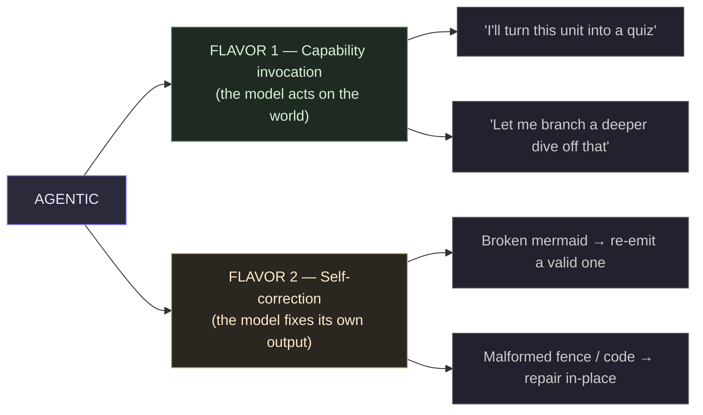
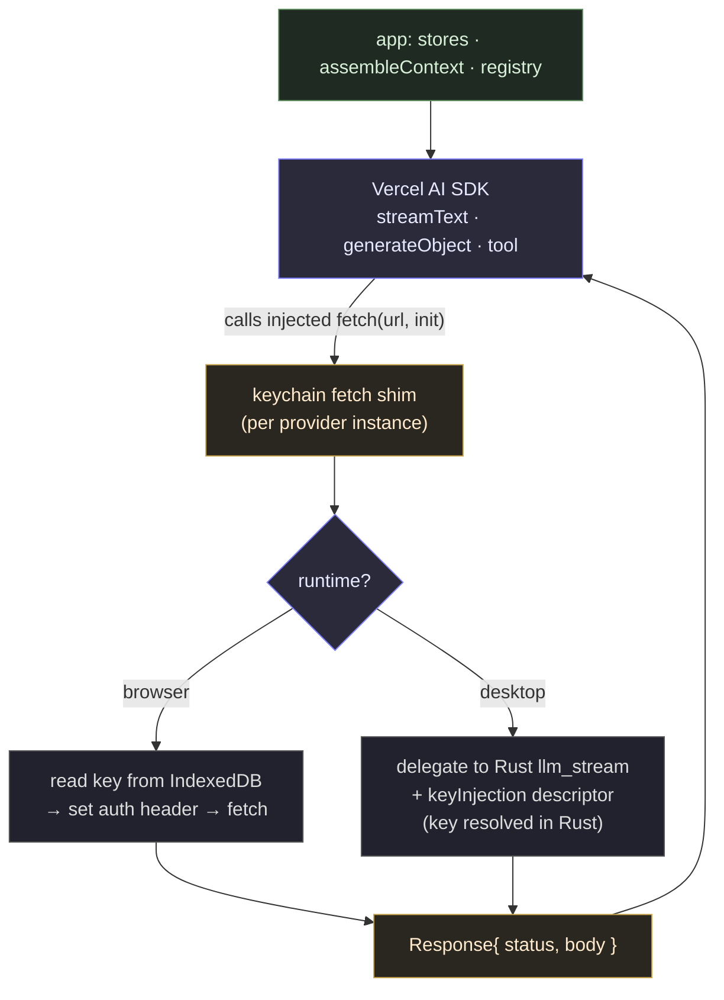
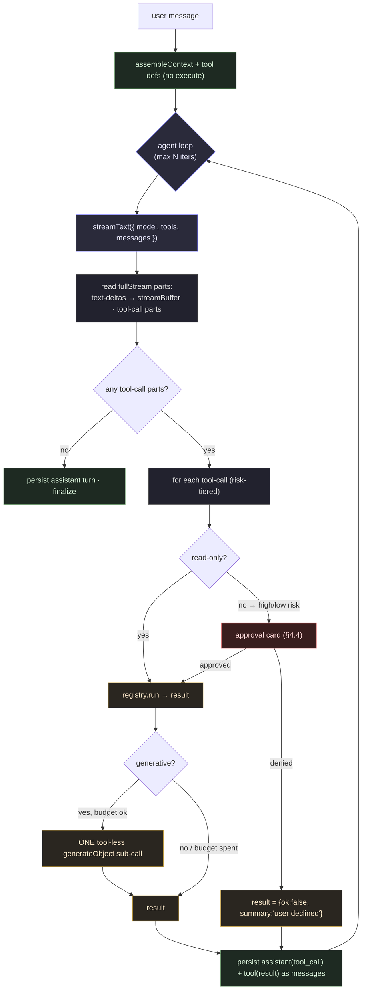
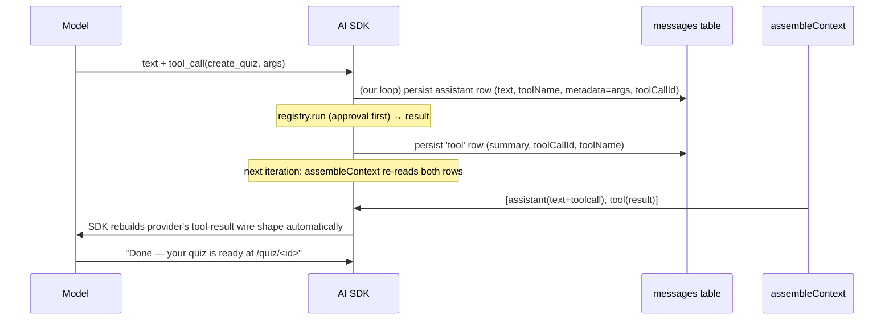
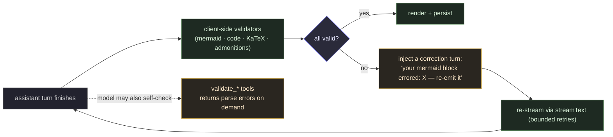
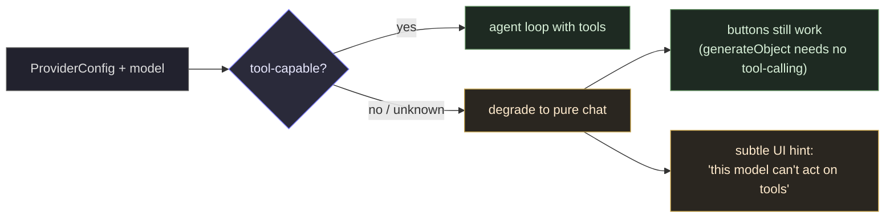
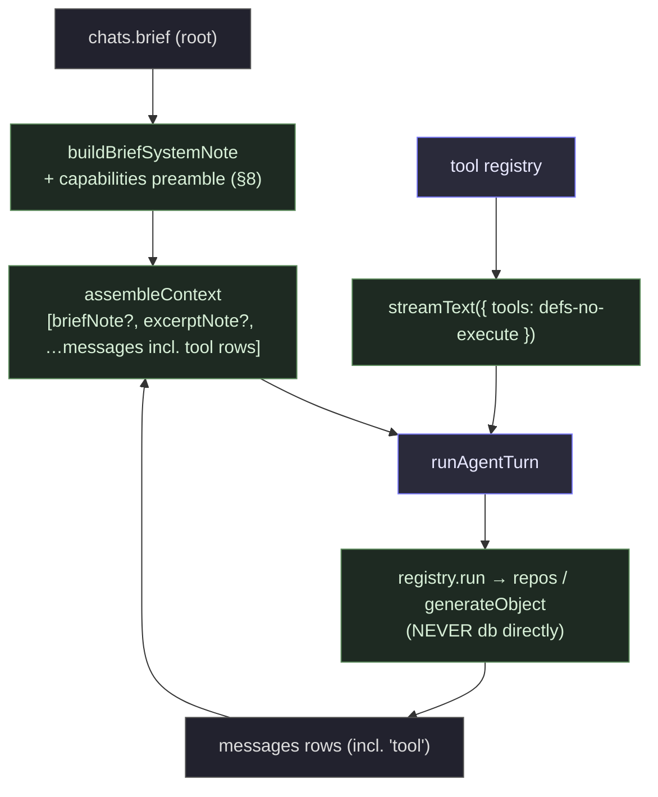

# Mayon — Agentic Capabilities: Exposing the App to the LLM

An architecture refinement of `refinement/architecture.md`. Treat that doc as the
authoritative system design; this layers an **agency epic** on top of the shipped
chat / labs / quizzes / learning-structure stack.

> **Status: WHITEBOARD / PROPOSAL.** This is a design + long-term strategy
> document for refinement. The phased build plan lands in
> `refinement/agentic-capabilities-phased.md` **only after this design is
> approved.** Open questions are in §12.

---

## 1. The vision — what "agentic" means for Mayon

Today the tutor is a **responder**: it sees `assembleContext` output and streams
prose. Every capability of the application — create a lab, generate a quiz,
branch a conversation, edit the brief, tick a checklist, render a diagram — is
**human-triggered by a button** and lives in a store, invisible to the model.

"Agentic" means closing that loop: **the tutor knows what the application can do,
and can invoke those capabilities itself, at the right moment, with the user's
consent.** Two distinct flavors, both in scope for the long term:



- **Flavor 1 — capability invocation.** The model decides a side-effect is
  warranted (create an artifact, branch, draft) and *requests* it; the app runs
  the capability and the result flows back into the conversation.
- **Flavor 2 — self-correction.** The model's own output is invalid (a mermaid
  block that won't parse, a malformed JSON fence) and a validator catches it,
  feeding the error back so the model repairs it before the turn lands.

This document is about making Mayon **primed and ready** for both: the
architecture, the strategy, the seams, and the concrete priming work — not the
task-level phased plan.

---

## 2. Current state & gap analysis

### 2.1 What exists today (and is an asset)

| Asset | Where | Why it matters for agency |
| ----- | ----- | ------------------------- |
| Single context chokepoint | `assembleContext` (`src/lib/chat/context.ts:37`) feeds chat + labs + quizzes + grading | One seam for memory of tool calls |
| Per-capability store actions | `chatStore` / `labsStore` / `quizzesStore` (`.send`, `.generate`, `.branchFromSelection`, `.toggleItem`, …) | The handlers we will unify into a registry |
| Prompt-driven structured output | `generate/fence.ts` + orchestrators (`generate.ts`, `generate-quiz.ts`) | A 3-attempt parse→correct→retry loop that is *literally* a baby agent loop |
| Capabilities already treated as "model emits a typed block → app acts" | `lab`/`quiz`/`brief`/`title`/`gate` fenced blocks | The pattern agency generalizes |
| StorageDriver + transport seams | `getHttpTransport()` (`http-transport.ts:75`), Tauri Rust bridge (`tauri-transport.ts:32`) | The single place the API key resolves — preserved under the AI SDK (§4.2) |

### 2.2 The gap (precisely)

1. **The model has no awareness of capabilities.** `buildBriefSystemNote`
   injects calibration + the strategy block — nothing about what the app *can do*.
2. **Capabilities are not callable by the model.** They are functions on stores,
   bound to buttons. There is no tool surface.
3. **There is no agent loop.** `chatStore.send` (`chat.svelte.ts:141`) streams one
   assistant turn and persists it. It cannot accept "the model wants to act, then
   continue."
4. **Tool actions are not remembered.** A created lab/quiz is a separate artifact;
   it never re-enters `assembleContext`, so a future turn cannot know it happened.
5. **No consent UX.** All side-effects are explicit user clicks today; autonomous
   action needs an approval affordance.

The gap is real but **structurally narrow**: it is a registry, a loop, a memory
extension, and a consent layer — built on seams that already exist.

### 2.3 The foundational posture decision — adopt the Vercel AI SDK

The single highest-leverage choice is **what sits between the app and the
providers**. Mayon currently hand-rolls four adapters (`openai-compatible`,
`anthropic`, `gemini`, `ollama`), two stream parsers (`parseSseStream`,
`parseNdjsonStream`), and a fenced-JSON structured-output protocol — all of which
the **Vercel AI SDK** already implements, maintains, and keeps current as
providers change their wire shapes. We adopt it as the foundation of the AI layer
rather than maintaining a bespoke fork of what it already does.

- **Adapters → SDK provider packages.** `@ai-sdk/openai` / `@ai-sdk/anthropic` /
  `@ai-sdk/google` plus a community Ollama provider. The wire-shape mapping that
  §4.2 would otherwise require (OpenAI `tool_calls` deltas vs Anthropic
  `tool_use` blocks vs Gemini `functionCall`) is the SDK's job, not ours.
- **Generation orchestrators → `generateObject` + Zod.** The fenced-JSON
  retry loop (`generate.ts`, `generate-quiz.ts`, `generate-brief.ts`,
  `generate-title.ts`) is retired in favor of the SDK's structured output, which
  is more reliable than fence parsing and provider-portable.
- **Streaming → `streamText`.** `Token`/`StreamEvent` bespoke types are retired;
  the SDK's `textStream` (deltas) and `fullStream` (parts incl. tool-calls) are
  the primitives.

**What we keep (not a fork — these are app seams above the SDK):**
`assembleContext`, the stores, the brief/strategy system, the schema, and **one
thin custom-`fetch` shim** that preserves the P5 keychain guarantee (§4.2). The
shim is the SDK's documented extension point, not a reimplementation.

This posture is locked; the rest of the doc assumes it.

---

## 3. Locked decisions

These are the foundational forks; the rest of the doc assumes them.

| # | Decision | Resolution | Accepted implication |
| - | -------- | ---------- | -------------------- |
| 1 | AI-layer foundation | **Adopt the Vercel AI SDK wholesale.** Adapters + SSE/NDJSON parsers + fence orchestrators are **retired**, replaced by SDK provider packages + `generateObject` + `streamText`. One custom-`fetch` shim preserves the P5 keychain. | A migration that retires ~4 adapters + 2 parsers + N orchestrators (§10). The fence protocol is retired for generation. Capability/tool support still varies per model (§6), but the SDK owns the wire mapping, so the burden collapses. |
| 2 | Autonomy / consent | **Ask, then act.** The model emits intent; an approval card confirms before any side-effect. Read-only / cheap tools auto-run silently. | *Forces us to drive the agent loop ourselves* rather than use the SDK's `maxSteps` (which auto-executes tools). Tools are defined with **no `execute`**; our loop runs them through the consent gate (§4.3, §4.4). |
| 3 | Generative tools (nested LLM calls) | **Cap depth at one.** A generative tool may spawn exactly one tool-less `generateObject` sub-call per turn, under a token/time budget and a hard recursion ceiling. | `create_quiz` / `create_lab` reuse `generateObject`; no unbounded recursion (§4.3). |
| 4 | Tool memory | **Tool calls as messages.** Each call + result is a typed `messages` row that re-enters `assembleContext`. | A **schema migration is required** (unlike the learning-structure epic) — additive nullable columns + a widened `role` enum (§4.5). Branches inherit tool history for free. |

### Resolved design forks (locked during refinement)

These were the open questions in earlier drafts; all are now resolved.

| # | Decision | Resolution | Accepted implication |
| - | -------- | ---------- | -------------------- |
| 5 | Tool-capability signal | **Declared defaults + session safety-net.** Seed from provider *kind* (anthropic/gemini = always; openai-compatible = true for known gateways; ollama = false). A Settings toggle overrides. If wrong, the SDK throws a tool-specific error → the loop catches it, sets a sticky in-session flag, disables tools, retries clean (one wasted call, once per session). | No curated per-model table to maintain; honest defaults, user-correctable, self-healing. OpenRouter's hundreds of routes degrade gracefully rather than needing enumeration. |
| 6 | Approval-card surface | **Inline, stacked.** One approval surface under the streaming bubble; ≥2 high-risk requests stack in order. Each card is independent (approve one, decline another). | Handles the common (1 card) and rare (queue) cases with one mechanism. A tray can be promoted later if stacking proves painful — premature now. |
| 7 | Where the loop lives | **Free function + chatStore delegates.** `runAgentTurn` is a function in `src/lib/agent/loop.ts` taking dependency-injected callbacks (`appendMessage`, `updateStreamBuffer`, `requestApproval`, `runTool`). `chatStore.send()` calls it with concrete impls. | Loop is fully unit-testable with mocks; `chatStore` stays single owner of the conversation view (matches the existing singleton pattern). Pure logic and stateful wiring cleanly separated. |
| 8 | Generative sub-call context | **Full context, same as buttons.** `create_quiz`/`create_lab` call `generateObject` over the full `assembleContext(chatId)` — identical grounding to the button path. | Cost bounded by cap-depth-one (at most one extra full-context call/turn). Context truncation, if ever needed, is a separate uniform optimization applied to all paths — not a tool-specific shortcut. |
| 9 | Tool-result memory weight | **Summary + pointer.** Tool-result rows store a compact summary (~30 tokens); full content lives in the artifact table + the row's `metadata` (not sent to the model). The model calls `read_artifact(id)` to pull details on demand. | Keeps long conversations cheap; lazy-loads depth when the model actually needs it. After 3 quizzes: ~90 tokens of summaries vs. ~6000 tokens of full content. |
| 10 | Critic scope (Stage 1) | **All rendered content types.** Validate mermaid, code blocks, KaTeX math, and admonition syntax from day one — everything the renderer handles. | Maximum self-correction coverage upfront. More validators to build, but each is small and independently testable; lower-frequency cases (KaTeX/admonition) are cheap once the critic scaffold exists. |
| 11 | Cross-chat agency boundary | **Current-chat-only through Stage 3.** Tools act only within the active chat. `cross_link` creates a reference FROM the current chat but never mutates the target. Cross-chat mutation is Stage 4 (opt-in, needs its own design). | Keeps the permission/conflict model trivial and the blast radius bounded. |
| 12 | SDK version + Ollama provider | **Stable major (not beta) + `ollama-ai-provider-v2`.** Pin the latest stable AI SDK major. Use `ollama-ai-provider-v2` for Ollama (2 core deps, web-compatible, tool-calling + streaming + thinking support). | Aligns with Mayon's "no unnecessary deps" ethos. Version specifics confirmed during the Phase A spike; reversible if a provider package lags. |

### Key tradeoffs (recorded so they aren't relitigated)

- **AI SDK over hand-rolled providers.** The SDK's enduring value is not a single
  feature but *not owning* the per-provider tool-call wire mapping forever. The
  cost is a dependency, version-churn tax (the SDK majors break; provider packages
  split across them), and browser bundle size — all *shared* with thousands of
  users rather than borne solo. We accept it; the maintenance asymmetry is the
  deciding factor.
- **Ask-then-act over act-then-report.** Mayon is a *learning* tool where
  surprise side-effects erode trust. One-tap approval keeps the human in authority
  over world-state. The consequence — driving the loop ourselves — is a feature,
  not a cost: the SDK still normalizes the streams; we only own consent + memory.
- **Cap depth at one.** True recursive sub-agents blow up cost/latency/abort
  complexity and are rarely needed for teaching artifacts. One level covers
  "decide to make a quiz → make it → report back." Deeper orchestration is later,
  opt-in (§11).
- **Tool calls as messages.** Keeps a single source of truth (`messages`),
  inherits reference-based branching, and needs no new table. The cost is that
  `assembleContext` must round-trip tool turns — but the SDK gives us the parts to
  persist; the burden is small.

---

## 4. Core architecture

### 4.1 The tool registry — single source of truth

Every capability the model *or* a button can invoke is one entry in a closed,
statically-declared registry. **Buttons stop calling stores directly; they (and
the agent) call `tools.run(id, args, ctx)`.** This is the central priming
refactor (§10) — it makes the human path and the agent path the *same* path.

```ts
// src/lib/agent/registry.ts (proposed)
export type ToolRisk = 'readonly' | 'low' | 'high';   // drives consent (§4.4)

export interface ToolDefinition {
  id: string;                       // 'create_quiz' — stable, model-facing name
  description: string;              // shown to the model (and the approval card)
  parameters: JsonSchema;           // JSON Schema the model fills
  risk: ToolRisk;
  /** May spawn ONE tool-less generateObject sub-call (create_quiz/create_lab). */
  generative: boolean;
}

export interface Tool {
  def: ToolDefinition;
  run(args: unknown, ctx: ToolContext): Promise<ToolResult>;
}

export interface ToolContext {
  chatId: string;
  rootChatId: string;
  signal: AbortSignal;
  /** Budget remaining for generative tools (cap-depth-one). */
  budget: { tokens?: number; subCalls: number; maxSubCalls: number };
}

export interface ToolResult {
  ok: boolean;
  /** Compact, model-friendly summary re-injected as the tool-result message. */
  summary: string;
  /** Optional opaque detail stored in the message row, not sent to the model. */
  detail?: unknown;
  /** For artifact-creating tools: where the user can go look at it. */
  artifact?: { kind: 'lab' | 'quiz' | 'chat'; id: string };
}
```

The registry renders to **SDK `tool()` definitions without `execute`** (§4.3) for
the model, and is the **only** place capabilities are declared. Adding a
capability is "add one `Tool`" — not "wire a new button, a new store method, and
a new prompt."

### 4.2 The AI SDK foundation + the keychain fetch shim

The SDK becomes the AI layer's foundation. The single thing Mayon must contribute
is a **custom `fetch`** that preserves the P5 security guarantee: on desktop the
plaintext API key never enters the webview. The SDK documents custom fetch for
exactly this ("adding authentication headers", "using a custom HTTP client"), so
the shim is an extension point, not a fork.



- **Browser runtime** — the browser is not a secure enclave; today
  `createFetchTransport` (`http-transport.ts:36`) reads the key from IndexedDB
  into the header. Under the SDK this is equivalent to **passing the key to the
  provider instance's `apiKey` config** (the SDK sets the header). No behavior
  change in threat model.
- **Desktop runtime** — the key stays in the OS keychain. The shim **does not**
  pass `apiKey`; instead it delegates to the existing Rust `llm_stream` bridge via
  a `keyInjection` descriptor (`{ header, scheme, keyId }`), exactly as
  `tauri-transport.ts:132` does today. Rust resolves the key and sets the header.
  The shim wraps the bridge's byte stream into a `Response` so the SDK can stream
  off `response.body`.
- **Per-provider auth scheme.** Each provider uses a different header (OpenAI
  `Authorization: Bearer`, Anthropic `x-api-key`, Gemini `x-goog-api-key`, Ollama
  none). The shim is built **per provider instance**, capturing its `keyId` +
  header scheme — the direct translation of today's `auth` descriptor
  (`StreamInit.auth`, `transport.ts:27`).
- **Error mapping.** The SDK throws its own `AI_APICallError` on non-2xx. We add
  one `mapSdkError(error)` at the call boundary that re-derives our typed set
  (`RateLimitError` for 429, `CorsBlockedError` on browser network failures,
  `ProviderHttpError` otherwise) so `formatProviderError` keeps working. **A
  Rust-bridge tweak may be needed**: today non-2xx surfaces as an in-band `Error`
  event (`tauri-transport.ts:77`); for the SDK to read the provider's error body
  the bridge should stream it on a `Response` with the real status. Flagged for
  the migration spike (§10).

> **What gets deleted:** the four adapters (`openai-compatible.ts`,
> `anthropic.ts`, `gemini.ts`, `ollama.ts`), the SSE/NDJSON parsers
> (`transport.ts`), and the fence-based generation orchestrators
> (`generate.ts`, `generate-quiz.ts`, `generate-brief.ts`, `generate-title.ts`,
> `generate-gate.ts`). The `HttpStreamTransport` interface survives as the shim's
> backbone; the SDK replaces everything above it.

### 4.3 The agent loop (driven by us, around `streamText`)

Decision #2 ("ask, then act") means the SDK's autonomous `maxSteps` loop is the
wrong tool — it auto-executes. Instead each iteration calls `streamText` **with
tools that have no `execute`**, and **our loop** runs the tools through consent.
The SDK gives us normalized parts; Mayon owns every guarantee.

> **Implementation shape (decision #7):** `runAgentTurn` lives in
> `src/lib/agent/loop.ts` as a free function taking dependency-injected callbacks
> (`appendMessage`, `updateStreamBuffer`, `requestApproval`, `runTool`).
> `chatStore.send()` calls it with concrete impls that touch store state — so the
> loop is fully unit-testable with mocks while `chatStore` stays the single owner
> of the conversation view.



**Invariants of the loop:**

- **Tools have no `execute`.** We define them via the SDK `tool()` helper with a
  schema but omit `execute` (or set it to throw). The SDK surfaces the tool-call
  as a part; *we* dispatch to `registry.run`. This is exactly what "ask, then act"
  needs — the SDK never acts on the world.
- **Cap depth at one (decision #3).** Generative tools (`create_quiz`,
  `create_lab`) call `generateObject` **with no `tools`**, so the sub-call cannot
  recurse. `budget.subCalls` (default `maxSubCalls = 1`) is the hard ceiling; a
  second generative request returns `{ok:false, summary:'one generative action
  per turn'}`.
- **Abort propagation.** A single `AbortController` covers the loop and in-flight
  sub-calls (mirrors the parallel title/brief-abort pattern, `chat.svelte.ts:84`).
  `Stop` cancels everything; partial text still persists (today's contract).
- **Bounded iterations.** `maxIterations` (e.g. 6) prevents runaway loops; on
  exhaustion the turn finalizes with a visible "tool budget exhausted" note.
- **`send` is the degenerate case.** With an empty tool manifest (provider lacks
  tool support, or tools disabled) the loop runs once and is today's `send`, via
  `streamText`'s `textStream`.

### 4.4 Consent layer (decision #2 — ask, then act)

Each tool carries a `risk` tier that decides whether it runs silently or asks:

| Tier | Examples | Behavior |
| ---- | -------- | -------- |
| `readonly` | `read_checklist`, `list_artifacts`, `summarize_progress` | Auto-run; result flows back invisibly |
| `low` | `draft_lab_skeleton`, `toggle_checklist_item`, `insert_note` | Auto-run with a dismissible "did X" toast (reversible / cheap) |
| `high` | `create_quiz`, `create_lab`, `branch_chat`, `navigate_to` | **Approval card required** before execution |

The **approval card** is a compact inline surface (alongside the streaming
bubble) showing the tool name, parsed arguments, and Approve / Decline. It blocks
*that tool* only — the model's prose still streams. When ≥2 high-risk tools fire
in one turn (possible via parallel tool-calls), the cards **stack in order**, each
independent (approve one, decline another) (decision #6). Decline is non-fatal:
the loop continues with `{ok:false, summary:'user declined'}`, and the model is
instructed to acknowledge and proceed (never to re-spam the same call).

This keeps the human the **authority over world-state** while letting the model
freely reason and read.

### 4.5 Memory: tool calls as messages (decision #4)

Tool actions become first-class context. Schema change is **additive** but does
require a migration (`pnpm db:generate` + `pnpm bundle:migrations`, per
`AGENTS.md`):

```ts
// src/lib/db/schema.ts — messages, extended
export const messages = sqliteTable('messages', {
  // …existing columns…
  role: text('role', { enum: ['system', 'user', 'assistant', 'tool'] }).notNull(), // + 'tool'
  content: text('content').notNull(),
  // NEW (all nullable → old rows unaffected)
  toolCallId: text('tool_call_id'),   // ties a 'tool' result row to the assistant's tool_call id
  toolName: text('tool_name'),        // which tool produced/owns this row
  metadata: text('metadata')          // JSON: tool args (on assistant tool_call rows) / detail
});
```

**How a turn round-trips** (the SDK owns wire shapes; we own persistence):



- **`assembleContext` changes minimally**: it already iterates `messages` and
  returns `ChatMessage[]`. Tool rows are included by the existing walk; branches
  inherit them via `rootId` for free. The only addition is mapping tool rows into
  the SDK's `CoreMessage` shape (assistant `tool-call` + `tool-result` parts) on
  the way into `streamText` — the SDK's `convertToCoreMessages` does the heavy
  lift.
- **Cost discipline (decision #9):** tool-result rows store a **compact summary**
  (~30 tokens — e.g. *"Created quiz 'Git Branching' with 5 questions at
  /quiz/<id>"*), not the full content. Full quiz/lab data lives in the artifact
  table + the row's `metadata` column (not sent to the model). The model can call
  `read_artifact(id)` to pull full details on demand. This keeps long
  conversations cheap: after 3 quizzes that's ~90 tokens of summaries vs. ~6000
  tokens of full content re-sent every turn.

### 4.6 Self-correction / critic loop (Flavor 2)

Capability invocation (§4.1–4.5) is "the model acts on the world." Self-correction
is "the model fixes its own output." The mermaid case the user raised is the
canonical example. Two complementary mechanisms:



- **Client-side critic (primary).** After a turn finishes, run local validators
  over the produced markdown — `renderMermaidBlock` already throws on bad syntax
  (`mermaid.ts:55`); generalize that into a `validateTurn(markdown)` that covers
  **all rendered content types**: mermaid diagrams, fenced code blocks, KaTeX
  math, and admonition syntax (decision #10). Each validator is small and
  independently testable. On failure, auto-inject a correction turn (no user
  involvement, ≤2 retries) and re-stream. This catches errors the model *didn't
  notice*, and generalizes the shipped `strategy-lint.ts` dev pattern into a
  production critic. **This needs no tool-calling at all** — it works even on
  tool-incapable providers.
- **`validate_*` tools (opt-in, for capable providers).** Offer
  `validate_mermaid` / `validate_json` / `validate_code` as `readonly` tools so
  the model can self-check *before* finishing when it's unsure. Cheap, optional,
  and uniform with the registry. (With the SDK, structured validation is also
  cheaply available via `generateObject` + Zod on parsed blocks.)

**Sequencing:** ship the critic loop first (universal, high-value), layer
`validate_*` tools later for models that will use them.

---

## 5. Capability taxonomy (the candidate tools)

A concrete first-pass catalog, classified by the axes that drive the loop.
Sequencing is a phased-plan concern; this is the *shape* of the surface.

| Tool | What it does | Risk | Generative | Notes |
| ---- | ------------ | ---- | ---------- | ----- |
| `create_quiz` | Generate a mixed quiz from the chat (via `generateObject`) | high | yes (depth-1) | Approval; navigates to `/quiz/<id>` on confirm |
| `create_lab` | Generate a hands-on lab (via `generateObject`) | high | yes (depth-1) | Approval; navigates to `/lab/<id>` |
| `draft_lab_skeleton` / `draft_quiz_outline` | Propose structure only (no nested LLM call) | low | no | Reversible draft; full generation stays a button |
| `branch_chat` | Fork a child off the current turn/excerpt | high | no | Approval; reuses `branchFromSelection` |
| `save_brief` / `edit_brief` | Adjust goal/level/mode/strategy | high | no | Approval; reflows next turn via `buildBriefSystemNote` |
| `toggle_checklist_item` | Tick a lab step | low | no | Auto-run w/ toast |
| `insert_note` | Drop a sticky note into the chat | low | no | Cheap, reversible |
| `read_checklist` / `list_artifacts` / `read_artifact` / `summarize_progress` | Inspect state | readonly | no | Auto-run; power the model's situational awareness |
| `validate_mermaid` / `validate_json` | Self-check output (Flavor 2) | readonly | no | Optional; complements the critic loop |
| `cross_link` | Link this chat to another | high | no | Approval; later scope (§13) |

**Two axes that matter most:** `risk` (drives consent) and `generative` (drives
the depth budget). A tool is cheap to add when it is non-generative and
`readonly`/`low`; generative + high tools are the high-leverage but high-cost
ones.

---

## 6. Provider capability heterogeneity

With the AI SDK absorbing wire-shape variance, the heterogeneity problem collapses
to a single axis: **does the *model* support tool-calling?** The SDK providers
declare this; calling `streamText({tools})` on an unsupported model throws.
Strategy: **declared capability + graceful degradation, never a hard failure.**



- **Capability is per-model, not per-provider.** Z.AI GLM-5.x, Claude, GPT-4o,
  Gemini support tools; tiny/Ollama models vary. We seed sensible defaults from
  the provider templates (`registry.ts:75`) and let a Settings flag override.
- **Degradation is transparent, not broken.** When the model can't do tools,
  `runAgentTurn` runs with an empty manifest → the loop is today's `send`. The
  model can't *self-initiate* artifacts; **the buttons still work** because
  `generateObject` for labs/quizzes/briefs does not require tool-calling (it uses
  the SDK's structured-output path, which is JSON-mode-or-tools internally). This
  is why retiring the fence protocol costs nothing in capability.
- **Invalid tool args.** Even where supported, a model may emit malformed args.
  We validate against the schema before execution; on failure we return
  `{ok:false, summary:'invalid arguments: …'}` so the model self-corrects within
  the iteration budget — no crash.

---

## 7. Composition with existing seams (no architecture-breakage)

The agency layer plugs into the seams `architecture.md` already mandates; it
violates none of the `AGENTS.md` boundaries:



- **Components/stores call repositories only.** Tool handlers call `repos.*`
  (never `db`), exactly as the stores do today. The registry is a peer of the
  stores, not a bypass.
- **`assembleContext` stays the single chokepoint.** It already feeds chat +
  labs + quizzes + grading; it now also carries tool-result rows.
- **Brief + strategy block are unchanged.** The strategy block
  (`strategies.ts`) still drives structure/density/pacing; agency layers
  capability awareness *on top*. A `create_quiz` tool produces a quiz whose
  content already follows the goal's strategy because `assembleContext` injects
  the block.
- **Reference-based branching inherits tool history.** Because tool calls are
  `messages` rows, a branch off Unit 3 inherits "a quiz was created in Unit 2"
  via the existing `rootId` walk — no special-casing.

---

## 8. System-prompt integration (keeping prompt cost low)

`buildBriefSystemNote` gains a short **capabilities preamble** (a few lines),
while the heavy tool specs travel in the SDK's native `tools` field (sent by the
SDK, not in the prompt). This keeps per-turn token cost near today's:

```text
You are a personal learning tutor. Calibrate to this learner's brief:
- Goal: <goal>  · Level: <level>  · Mode: <mode>  · Structure: <strategy>
- Scope: <scope>

<STRATEGY BLOCK>

You can act on the learner's behalf using the provided tools when it clearly
helps the goal — e.g. offering to turn a finished unit into a quiz, or branching
a deeper dive. You will ask before doing anything that creates or changes
artifacts. Prefer continuing the lesson over invoking tools. Full tool specs are
provided separately; use them judiciously, not every turn.

Teach to the goal at the stated level; stay within scope.
When the learner can do the goal, say so.
```

- "Prefer continuing the lesson over invoking tools" is the key restraint —
  agency is an *opportunity*, not a mandate.
- Native tool descriptions (rich, with examples) live in the `tools` field and
  cost tokens only when tools are enabled (capable providers). On degraded
  providers the preamble is omitted entirely.

---

## 9. Cross-cutting concerns

- **Cost / latency budget.** Cap-depth-one bounds the worst case at
  `1 + (iterations × cheap tools) + 1 generative sub-call`. A per-turn token cap
  and `maxIterations` (§4.3) keep it predictable; the dev strategy-lint hook
  (`chat.svelte.ts:196`) extends to log tool-call counts in `DEV`.
- **Abort.** One `AbortController` spans the loop and any in-flight sub-call,
  mirroring the existing parallel title/brief-abort pattern. `Stop` cancels
  cleanly; partial text persists (today's contract).
- **Error handling.** The SDK's errors are mapped once at the call boundary
  (§4.2) to Mayon's typed set, then routed through `formatProviderError` into
  `chatStore.error` — preserving the exact UX today (CORS → "use desktop",
  rate-limit → retry hint, etc.). Tool failures never crash the turn: a handler
  exception becomes a `{ok:false, summary:'…'}` result.
- **Security (local-first).** Tools are a **closed, statically-declared set**.
  The model cannot define new tools, execute arbitrary code, or make network
  calls. Tool handlers touch only local `repos` + the app's own `generateObject`
  — no key access, no egress. The custom-fetch keychain seam (§4.2) preserves the
  "no key-in-webview on desktop" P5 guarantee: the SDK holds no `apiKey` on
  desktop; Rust resolves it.
- **Version churn.** The AI SDK majors break; provider packages split across
  them. We **pin** to a stable major (not beta) in `package.json`, treat upgrades
  as deliberate migrations, and keep the keychain shim + `assembleContext` stable
  so upgrades are isolated to the AI layer.
- **Observability.** Local-only structured logs of tool invocations (name, args
  hash, outcome, ms) in `DEV`; no telemetry (personal app, per
  `architecture.md` §10).
- **Testing posture.** Pure modules (`registry.ts`, `mapSdkError`, the critic
  validators) are unit-tested; the loop is tested with the SDK's mocked provider
  / canned part streams. The schema migration is covered by the Vitest in-memory
  driver suite.

---

## 10. Migration & priming targets

This is now a **two-phase effort**: first a pure refactor onto the AI SDK
(behavior identical to today — no agency), then the additive agency layer on a
prepared foundation. The phased plan (`agentic-capabilities-phased.md`) will
break these into milestones; this is the target sequence.

### Phase A — Port onto the AI SDK (no behavior change)

1. **Add the dependency + the keychain fetch shim.** `ai` + the provider packages,
   pinned to a stable major. Implement the per-provider custom fetch that
   preserves P5 (§4.2). *Verify: desktop key never enters JS; browser key from
   IndexedDB; errors map back to typed classes.* (This is the spike that de-risks
   the whole posture.)
2. **Port the 4 adapters → SDK provider instances.** Delete `openai-compatible.ts`,
   `anthropic.ts`, `gemini.ts`, `ollama.ts` and the SSE/NDJSON parsers. A small
   factory builds the SDK provider per `ProviderConfig`, wiring the keychain fetch.
   `getActiveProvider()` returns an SDK-backed model instead of the old `Provider`.
3. **Port generation → `generateObject` + Zod.** Replace `generate.ts`,
   `generate-quiz.ts`, `generate-brief.ts`, `generate-title.ts`,
   `generate-gate.ts` + `fence.ts` with typed Zod schemas. The lab/quiz/brief
   *shapes* are unchanged; the parser is now the SDK + Zod. The retry loop
   collapses (the SDK retries internally).
4. **Port `chatStore.send` → `streamText`.** Use `textStream` for token
   accumulation; keep the parallel title/brief inference and the dev strategy-lint.
   At this point behavior is **byte-for-byte today** on a different engine.

After Phase A: identical UX, far less code, agency-ready foundation.

### Phase B — Add agency (additive)

5. **Tool registry skeleton (`src/lib/agent/registry.ts`).** The `Tool` /
   `ToolDefinition` / `ToolContext` types + `TOOLS` map, initially `readonly`
   inspection tools only. No loop, no UI.
6. **Unify capability handlers behind the registry.** Refactor buttons to call
   `tools.run(...)` instead of stores directly. Behavior unchanged; human path and
   agent path become one. *Highest leverage, zero user-visible change.*
7. **Schema migration for tool-call messages.** Widen `role` to `'tool'`; add
   nullable `toolCallId` / `toolName` / `metadata`. Run `db:generate` +
   `bundle:migrations`. Extend `assembleContext` + the SDK `convertToCoreMessages`
   round-trip for tool rows (§4.5). *The one migration-bearing priming step.*
8. **Client-side critic (`src/lib/agent/critic.ts`).** Generalize
   `strategy-lint.ts` + `mermaid.ts`'s throw-on-parse into `validateTurn` + bounded
   auto-correction. Ships real Flavor-2 value (mermaid self-fix) **before** any
   tool-calling goes live.
9. **`ProviderCapability` plumbing + the agent loop.** Add the tool-capable flag;
   implement `runAgentTurn` around `streamText` with consent (§4.3–4.4).

---

## 11. Long-term evolution (conceptual stages, not task phases)

A north-star progression. Each stage is independently shippable and demonstrable.

```mermaid
flowchart LR
  A0["PHASE A — SDK migration<br/>(no behavior change)"]:::a0
  A0 --> S0["STAGE 0 — Priming<br/>(registry · schema · critic · caps)"]:::s0
  S0 --> S1["STAGE 1 — Read-only agency + critic<br/>(inspection tools live; mermaid self-fix live)"]:::s1
  S1 --> S2["STAGE 2 — Deterministic tools + consent<br/>(branch · draft · toggle · save_brief; approval cards)"]:::s2
  S2 --> S3["STAGE 3 — Capped generative tools<br/>(create_quiz/create_lab depth-1; sub-agent budgets)"]:::s3
  S3 --> S4["STAGE 4 — Deeper orchestration (opt-in)<br/>(multi-step plans · cross-chat agency · validate_* tools)"]:::s4
  classDef a0 fill:#2a2a3a,stroke:#7c7cff,color:#e8e8ff
  classDef s0 fill:#1e2a22,stroke:#5a8a5a,color:#d8f0d8
  classDef s1 fill:#1e2a22,stroke:#5a8a5a,color:#d8f0d8
  classDef s2 fill:#2a2620,stroke:#c8a44a,color:#ffeacc
  classDef s3 fill:#2a2620,stroke:#c8a44a,color:#ffeacc
  classDef s4 fill:#2a2a3a,stroke:#7c7cff,color:#e8e8ff
```



- **Phase A — SDK migration.** §10. The engine swap; identical UX.
- **Stage 0 — Priming.** Registry, schema, critic, capability flags. No autonomous
  behavior.
- **Stage 1 — Read-only agency + critic.** The model can *look* (progress,
  artifacts) and the critic auto-fixes all rendered content types (mermaid, code,
  KaTeX, admonitions). First user-visible win, near-zero risk.
- **Stage 2 — Deterministic tools + consent.** `branch`, `draft_*`, `toggle`,
  `save_brief` go live behind inline-stacked approval cards.
- **Stage 3 — Capped generative tools.** `create_quiz` / `create_lab` as depth-1
  sub-agents. The headline capability ("the tutor offers to make a quiz, you
  approve, it's made") lands. **Hard invariant: all tools act only within the
  active chat** (decision #11).
- **Stage 4 — Deeper orchestration (opt-in).** Multi-step plans, cross-chat
  agency, richer `validate_*` suites. Explicitly out of near-term scope (§13).

---

## 12. Resolved questions

All eight open questions from earlier drafts are now locked — see the "Resolved
design forks" table in §3 (decisions #5–#12). No open questions remain; the
design is ready for the phased build plan
(`refinement/agentic-capabilities-phased.md`).

---

## 13. Non-goals (this epic / near-term)

- **Recursive multi-agent systems.** Cap-depth-one is the ceiling through Stage
  3; unbounded agent trees are Stage-4-and-beyond and opt-in.
- **Cross-chat / ambient agency** (mutating *other* conversations) before Stage 4.
  v1 acts only within the active chat.
- **Arbitrary code execution / network egress tools.** The tool set is closed and
  local-only by design (§9). A "runnable lab sandbox" remains a separate future
  seam (`architecture.md` §10).
- **Preserving the hand-rolled adapters / fence protocol.** They are retired in
  Phase A (decision #1) in favor of the AI SDK + `generateObject`. They are not
  maintained in parallel.
- **Changing the teaching contract.** The strategy block remains the source of
  structure/density/pacing; agency is layered on top, it does not subsume it.
- **A server-side agent runtime.** Mayon is local-first; the loop runs in the
  SPA/Tauri shell, same as `chatStore.send` today.
