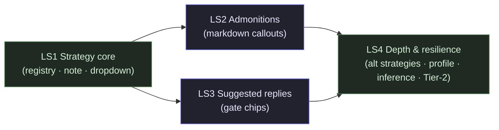

# Mayon — Learning Structure: Phased Build Plan

Implementation phases for the **mode-scoped teaching strategy** epic defined in
`refinement/learning-structure.md`. Treat that doc as the authoritative design;
this is the delivery breakdown.

> Each phase ships a demonstrable slice and is the prerequisite ordering for the
> next. `LS1` is the long pole; `LS2` and `LS3` are independent of each other.

## Locked decisions (resolved from design §13)

These design forks are now **locked** so the plan is self-contained:

| # | Decision                                                                                         | Resolution                                                                              |
| - | ------------------------------------------------------------------------------------------------ | --------------------------------------------------------------------------------------- |
| 1 | Dropdown shape                                                                                   | **Mode-scoped only.** The dropdown shows the active mode's strategies (3 each). Mode stays the primary axis. |
| 2 | Tier-1 suggested-reply chips                                                                     | **Always on** for gated strategies (Explainer `guided-curriculum`/`deep-dive`/`quick-orientation`, Build `workshop`/`tutorial`). Inert if the user types instead. Free-form strategies (Socratic, `reference-manual`) show none. |
| 3 | Admonition renderer timing                                                                       | **Ship in LS2, immediately after LS1.** Build's callouts render as readable-but-plain blockquotes during LS1 (intentional, short-lived degraded state). |
| 4 | Socratic substance floor                                                                         | **Yes — a floor, not a lecture.** `guided-inquiry` enforces `anchor → framing → probe`, never answers its own probe. |
| 5 | Density word-bands                                                                               | **As specified** (design §10); Explainer unit floor 250, Socratic floor 120. Tunable via the prompt blocks. |
| 6 | Quick-orientation vs. reference-manual                                                           | **Both kept** (defer to LS4). LS1 ships the one default per mode only.                  |

---

## Milestones at a glance

| Phase | Name                                        | Result                                                                                  | Size | Depends on |
| ----- | ------------------------------------------- | --------------------------------------------------------------------------------------- | ---- | ---------- |
| LS1   | Strategy core (registry + note + dropdown)  | Strategy dropdown works; the 3 default strategy blocks drive chat + labs + quizzes      | M    | —          |
| LS2   | Admonition callouts (markdown pipeline)     | `> [!NOTE/TIP/WARNING/…]` renders as styled shadcn callouts                             | S    | LS1        |
| LS3   | Pacing-gate suggested replies               | Composer shows context-chips for gated strategies ("continue" / "next" / …)             | S    | LS1        |
| LS4   | Depth & resilience                          | Remaining strategies + profile default + inferred-brief schema + Tier-2 gates + density linter | M | LS1 (LS2/LS3 help) |

### Recommended sequencing



`LS1 → (LS2 ‖ LS3) → LS4`. **LS2 and LS3 are independent** and may be built in
either order or in parallel. `LS4` benefits from but does not hard-depend on
`LS2`/`LS3`.

---

## LS1 — Strategy core (registry + note + dropdown) `Size: M`

**Goal:** a selectable teaching strategy reaches the system prompt and changes
how the tutor structures output — for all three modes, end-to-end, with no new
UI affordances beyond the dropdown. After LS1 the user's three core complaints
(structure/density for Explainer, substance floor for Socratic, code emphasis
for Build) are addressed; gates work as plain text ("type continue").

**Scope**

- The **strategy registry** + resolution helpers in `src/lib/chat/brief.ts`:
  `ScopeStrategyId`, `ScopeStrategy` interface, `SCOPE_STRATEGIES`,
  `strategiesForMode(m)`, `defaultStrategyFor(m)`, `SCOPE_STRATEGY_IDS`.
- The **three default strategy blocks** (one per mode): `guided-curriculum`
  (Explainer), `guided-inquiry` (Socratic), `workshop` (Build) — verbatim from
  design §6. These are the prompt-engineering payloads that replace the one-line
  `MODE_INSTRUCTIONS`.
- Extend `buildBriefSystemNote` (`brief.ts:165`) to **emit the strategy block**
  and drop the subsumed mode one-liner (design §7). `scope` free text, when
  present, adds a density/budget line.
- Extend `parseBrief` (`brief.ts:130`) with an `isScopeStrategy` guard so the
  new field round-trips safely (unknown/garbage → omitted → default).
- Extend `applyProfile` (`brief.ts:98`) precedence to include `scopeStrategy`
  (brief > profile > mode-default); extend `LearnerProfile` + `DEFAULT_PROFILE`.
- The **scope dropdown** in `BriefCard.svelte` — mode-dependent options, seeded
  from the profile in intake, reactive on mode change; folded into `buildBrief`.

### New files

- `src/lib/chat/strategies.ts` — **the registry + block text.** Splitting the
  long block strings out of `brief.ts` keeps that module's parser/note-builder
  focused (mirrors how the example separates concerns). Exports the types and
  `SCOPE_STRATEGIES` array; `brief.ts` re-exports the resolution helpers.
  ```ts
  export type ScopeStrategyId = 'guided-curriculum' | 'deep-dive' | 'quick-orientation'
    | 'reference-manual' | 'guided-inquiry' | 'devils-advocate' | 'case-based'
    | 'workshop' | 'tutorial' | 'pair-programming';

  export interface ScopeStrategy {
    id: ScopeStrategyId;
    label: string;          // dropdown text
    hint: string;           // one-line "what you get"
    modes: BriefMode[];     // which modes offer this pick
    gated: boolean;         // ends turns with a pacing gate (drives chips in LS3)
    block: string;          // the prompt-engineering payload (design §6)
  }
  export const SCOPE_STRATEGIES: ScopeStrategy[] = [ /* 3 defaults in LS1, rest in LS4 */ ];
  export function strategiesForMode(m: BriefMode): ScopeStrategy[];
  export function defaultStrategyFor(m: BriefMode): ScopeStrategyId;
  export function resolveStrategy(brief: Partial<LearningBrief>, profile: LearnerProfile): ScopeStrategy;
  ```

### Modified files

- **`src/lib/chat/brief.ts`** — re-export strategy types; extend
  `LearningBrief` with `scopeStrategy?`; extend `parseBrief` (the guard line),
  `applyProfile`, `LearnerProfile`, `DEFAULT_PROFILE`; rewrite
  `buildBriefSystemNote` to append the resolved `block` (drop `MODE_INSTRUCTIONS`).
- **`src/lib/components/chat/BriefCard.svelte`** — add a **Structure** select
  below the Mode select, options = `strategiesForMode(modeVal)` (re-derives when
  mode changes); seed from profile in `onMount`; include in `buildBrief()`.
- **`src/lib/chat/profile.ts`** — `LearnerProfile`/`getLearnerProfile` carry
  `scopeStrategy` (already flows through `applyProfile`; no storage change — it
  lives in the existing `learnerProfile` settings KV JSON).
- **`src/lib/chat/brief.test.ts`** — strategy resolution (brief > profile >
  default), registry lookups (`strategiesForMode` correctness), `parseBrief`
  round-trip with `scopeStrategy`, snapshot-precedence cases, and the **new**
  `buildBriefSystemNote` asserting the block is present and the old one-liner is
  gone. Update the "byte-for-byte today's output" null-brief test (unchanged —
  a null brief still emits no note).

### Tests

- `brief.test.ts`: `resolveStrategy` precedence per mode; `strategiesForMode`
  returns exactly the right ids; `defaultStrategyFor` per mode; `parseBrief`
  accepts/rejects `scopeStrategy`; note builder emits block + drops one-liner;
  null-brief still produces no note (escape-hatch fidelity).
- Manual: intake → pick a strategy → "Start learning" → first reply follows the
  structure (Explainer orientation + roadmap + "continue?" gate; Socratic three-
  part dense turn; Build code-first turn with a `> [!NOTE]` that renders as a
  plain blockquote for now). Edit via summary chip → change strategy →
  recalibrates on next turn. **Reload persists.** A null-brief chat behaves
  exactly as today.

### Acceptance

- `pnpm test` / `pnpm check` / `pnpm lint` clean.
- Manual gates above; branching still inherits the strategy (a child gets the
  root's strategy via `rootId` — verify by branching mid-curriculum).

**Dependencies:** none (entry point). The `chats.brief` schema is unchanged
(strategy rides in the existing JSON column), so **no migration, no
`db:generate`/`bundle:migrations`**.

---

## LS2 — Admonition callouts (markdown pipeline) `Size: S`

**Goal:** `> [!NOTE]` / `[!TIP]` / `[!WARNING]` / `[!CONCEPT]` / `[!INFO]` blocks
emitted by the strategy prompts render as styled shadcn-style callouts instead
of plain blockquotes with a literal `[!TYPE]`. Makes Build's (and Socratic's
pivotal-idea) callouts land correctly.

**Scope**

- A small **remark plugin** (or rehype transform) that detects a blockquote
  whose first line is `[!TYPE]` (GitHub-Alerts syntax) and rewrites it into a
  `<div class="callout callout-<type>">` with the title as a heading and the
  remaining lines as the body. Inserted into the `render.ts` pipeline **before**
  `rehype-sanitize`.
- **Sanitize allowlist** widening (`sanitizeSchema` in `render.ts:40`): permit
  `div` with `callout` / `callout-*` classNames; keep `className` matching
  bounded (not a blanket `^.*$`) so the sanitizer still does its job.
- **Recognized types** (per design §9): `NOTE`, `TIP`, `WARNING`, `CONCEPT`
  (Socratic), `INFO` (Explainer). Unknown types render as a neutral `callout`
  (never broken, never raw `[!]`).
- **Restraint enforcement is prompt-side** (the blocks already say "≤1 per ~4–5
  paragraphs"); the renderer does **not** post-process/collapse callouts — it
  only styles what the model emits.
- Callout styles in `Markdown.svelte` (superset of the existing blockquote style;
  plain blockquotes are unaffected).

### New files

- `src/lib/markdown/admonition.ts` — the remark/rehype transform (pure,
  unit-testable). `admonitionTypes` exported for the renderer/tests.

### Modified files

- **`src/lib/markdown/render.ts`** — `.use(admonition)` in the `processor`
  pipeline (between `remarkGfm`/`remarkMath` and `remarkRehype`, or as a rehype
  plugin before sanitize — whichever the chosen implementation requires); widen
  `sanitizeSchema.attributes.div` with `['className', /^callout$/, /^callout-./]`.
- **`src/lib/components/chat/Markdown.svelte`** — add `:global(.callout …)` rules
  (one accent color per type: note/tip/info = neutral-blue, warning = amber,
  concept = purple). Keep the existing plain-blockquote style intact.

### Tests

- `admonition.test.ts` (or extend a render test): each recognized type → correct
  `<div class="callout callout-<type>">` with title + body; unknown type →
  neutral callout (no crash, no literal `[!]`); non-alert blockquote (`> just a
  quote`) → unchanged `<blockquote>`; sanitize does **not** strip the callout
  classes (integration with `renderMarkdown`).

### Acceptance

- `pnpm test` / `check` / `lint`.
- Manual: in a Build chat, the strategy's `> [!WARNING]` now renders as an amber
  callout (not a blockquote with literal `[!WARNING]`); a Socratic `[!CONCEPT]`
  renders purple; a plain `>` quote still renders as before. Verify sanitization
  keeps the classes (no `Dangerously` bypass).

**Dependencies:** LS1 (the prompts that emit the syntax land in LS1). The LS1
degraded state (plain blockquote) is replaced here.

---

## LS3 — Pacing-gate suggested replies `Size: S`

**Goal:** gated strategies surface their gate options as **suggested-reply
chips** in the Composer, so the learner can "continue" / "go deeper" / "next" /
"paste the error" with one tap instead of typing. **Tier 1 only** — chips are a
static per-strategy list; no parsing of model output required.

**Scope**

- Each gated `ScopeStrategy` gains a `replies?: string[]` field (in
  `strategies.ts`): `guided-curriculum` → `['continue', 'go deeper']`,
  `quick-orientation`/`deep-dive` → `['continue', 'go deeper']`, `workshop` →
  `['next', 'paste the error']`. Non-gated strategies (Socratic,
  `reference-manual`) have `replies = undefined` → no chips.
- The **Composer** renders a chip row (above/below the textarea) whose contents
  come from the **active strategy** — threaded in as a prop from the route (the
  route already has the chat/brief). A chip click fills the textarea and sends
  (reuses the existing `send()` path; same as typing + ⌘/Enter).
- Chips are **inert if the user types** — they're suggestions, never blocking.
  They are hidden while streaming (the Send/Stop button pair already swaps).

### New files

- (none — `replies` lives on `ScopeStrategy` in `strategies.ts`; the chip row is
  inline in `Composer.svelte`.)

### Modified files

- **`src/lib/chat/strategies.ts`** — add `replies?: string[]` to the interface
  and populate the gated strategies.
- **`src/lib/components/chat/Composer.svelte`** — accept a `suggestedReplies?:
  string[]` prop; render a chip row (disabled while `streaming`); a chip click
  calls `onSend(chipText, reasoning)`.
- **`src/routes/chat/[id]/+page.svelte`** (+ the new-chat route) — resolve the
  active strategy from the root brief and pass `suggestedReplies` to
  `Composer`. The active strategy is `resolveStrategy(parseBrief(root.brief),
  profile)`; null brief → no chips.

### Tests

- Component-level (if a Composer test exists) or a small pure helper test: gated
  strategy → `replies` non-empty; non-gated → `undefined`. (Chip rendering is
  trivial UI; the contract worth pinning is "gated ⇒ chips, non-gated ⇒ none".)

### Acceptance

- `pnpm test` / `check` / `lint`.
- Manual: Explainer orientation lands → "continue" / "go deeper" chips appear →
  tap "continue" sends the next unit; Build increment lands → "next" chip sends
  the next step. A Socratic chat shows no chips. Typing instead of tapping works
  identically. **Reload persists** (the chips derive from the persisted brief).

**Dependencies:** LS1 (needs the registry + `replies` + `resolveStrategy`).
Independent of LS2.

---

## LS4 — Depth & resilience `Size: M`

**Goal:** round out the strategy catalog, wire the strategy through the learner
profile and the AI-inferred brief, and add the optional structured-gate (Tier 2)
and a dev-only density linter for prompt tuning.

**Scope**

- **Remaining strategies** in `strategies.ts`: Explainer `deep-dive`,
  `quick-orientation`, `reference-manual`; Socratic `devils-advocate`,
  `case-based`; Build `tutorial`, `pair-programming`. Each with its `block`
  (authored to the same density-model contract, design §10) and `replies`
  where gated.
- **Profile default strategy**: `LearnerProfileConfig.svelte` gains a Structure
  default select (mirrors its existing level/mode selects) →
  `setLearnerProfile`. Snapshot semantics already hold via `applyProfile`.
- **Inferred brief** (`generate-brief.ts`): add `scopeStrategy` to
  `GeneratedBriefSchema` (`generate-brief.ts:37`, `.strict()`), the prompt's
  field list (`generate-brief.ts:11`), the example, and the correction
  instruction. So a "Just start chatting" root can be proposed a strategy, not
  just a goal.
- **Tier-2 structured gates** (optional, deferred-by-default): the model emits a
  fenced `gate` tail `{ nextUnit, options[], progress }`, parsed on stream
  **finish** (never mid-stream — mirrors the lab fence pattern). The UI upgrades
  chips to be context-aware and renders a **progress rail** (Unit 2 / 5). Strict
  additive: if skipped, Tier 1 (LS3) keeps working.
- **Dev-only density linter** (`import.meta.env.DEV`): scores a finished
  assistant turn against its declared skeleton (required parts present? above
  word floor? ≤1 callout/increment?) and surfaces pass/fail — analogous to the
  P0 `DbStatus` self-check. Used to tune the blocks; never shipped to users.

### New files

- `src/lib/ai/generate/generate-gate.ts` — (Tier 2 only) `parseGateBlock`,
  `GateBlock` Zod schema, `extractGateBlock` over `extractFencedJson`. Skipped
  if Tier 2 is deferred this phase.
- `src/lib/dev/strategy-lint.ts` — (dev-only) the density scorer.

### Modified files

- **`src/lib/chat/strategies.ts`** — the 7 additional strategies + their blocks.
- **`src/lib/components/chat/LearnerProfileConfig.svelte`** — Structure default
  select.
- **`src/lib/ai/generate/generate-brief.ts`** — schema/prompt/example +
  `GeneratedBrief` type (`Pick<LearningBrief,…>` picks up the new field once
  `LearningBrief` carries it from LS1).
- **`src/lib/components/chat/Composer.svelte`** + **`+page.svelte`** — (Tier 2)
  consume the parsed `gate` block for context-aware chips + progress rail.
- **`src/lib/components/chat/MessageRow.svelte`** (or the markdown post-process)
  — (Tier 2) strip the fenced `gate` tail from the rendered turn (it's data, not
  prose; like the lab fence, it never belongs in the visible message).

### Tests

- `generate-brief.test.ts`: `parseGeneratedBrief` accepts `scopeStrategy` with a
  valid enum, rejects an unknown strategy id, rejects extra keys (`.strict()`).
- `strategies.test.ts`: every `ScopeStrategyId` resolves to exactly one registry
  entry; every `BriefMode` has ≥1 strategy and a defined default; all gated
  strategies have `replies`; all blocks are non-empty.
- `strategy-lint.test.ts`: a skeleton-complete turn scores pass; a turn missing
  a required part or under the floor scores fail.

### Acceptance

- `pnpm test` / `check` / `lint`.
- Manual: Settings → set a profile default strategy → "New chat" intake
  pre-selects it; override per-brief and both persist independently (snapshot).
  "Just start chatting" → inferred brief proposes a strategy → "Use this"
  recalibrates. Switch a strategy mid-chat → structure changes on the next turn.
  (Tier 2, if built:) progress rail advances across units.

**Dependencies:** LS1 (registry/`resolveStrategy`). Benefits from LS2 (callouts)
and LS3 (chip plumbing) but not hard-required. Tier 2 reuses LS3's chip surface.

---

## Cross-cutting concerns

- **Backward compatibility:** the strategy rides in the existing `chats.brief`
  JSON column — **no schema migration, no `db:generate`/`bundle:migrations`**
  across all four phases. `parseBrief` is total; old rows resolve to the mode
  default and behave ~as today (only richer).
- **Statelessness:** the lesson position is reconstructed from history each turn
  (orientation + gate prompts are in the message set via `assembleContext`). No
  server-side pacing state; branching inheritance stays intact.
- **Prompt cost:** the block (~200–400 tokens) is added once per assembled
  context — negligible, consistent with the shipped brief note. LS4 Tier-2 adds
  one parsed tail per gated turn (no extra request).
- **No streaming post-processing:** density is *instructed*, never enforced by
  truncating/rewriting tokens (which would corrupt partial markdown). The only
  post-processing is rendering (callouts) and, in Tier 2, stripping the data
  fence from the visible turn.
- **Testing posture:** pure modules (`strategies.ts`, `admonition.ts`,
  `generate-gate.ts`, `strategy-lint.ts`) are unit-tested; the note-builder and
  parsers are pinned to their schemas. UI changes are validated by the manual
  gates (the existing pattern for chat components).

## Risks / edge cases (per phase)

- **LS1 note-builder change:** the "byte-for-byte today's output" test is
  intentionally updated (this is a behavior change, gated on a strategy being
  present). The **null-brief** output stays byte-for-byte identical (escape
  hatch preserved) — keep that assertion.
- **LS2 sanitize:** widening `div` classNames risks weakening the sanitizer;
  keep the `className` match bounded (`/^callout$/, /^callout-./`), never a
  blanket allow. Unknown admonition types must degrade to a neutral callout, not
  raw text.
- **LS2 mermaid coexistence:** the admonition transform and the mermaid
  post-processor both touch rendered HTML; verify an admonition-containing turn
  with a mermaid block renders both correctly.
- **LS3 chip→send parity:** a chip must be indistinguishable from typing the
  same text + Send (same `onSend` path, same persistence). No special-casing in
  `chatStore.send`.
- **LS4 Tier-2 fence stripping:** the `gate` fence must be removed from the
  **stored** message (so it never re-enters `assembleContext` as prose) or
  stripped only at render — pick one and test it (the lab path stores raw; the
  quiz path parses; here the turn is stored *without* the data tail).
