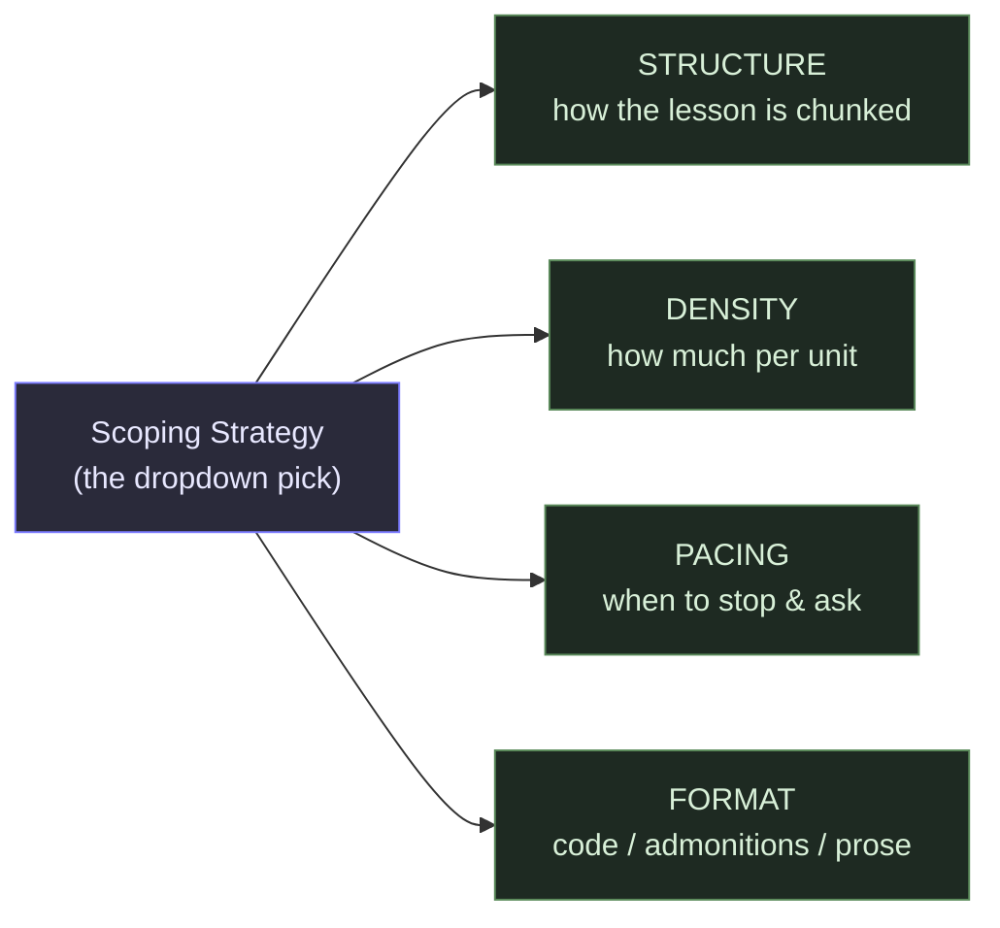
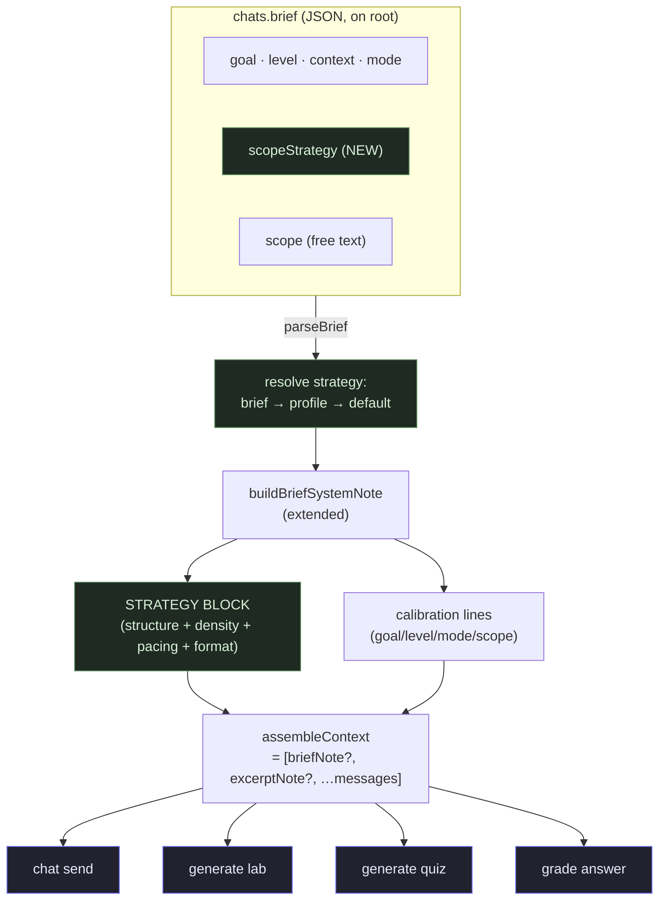
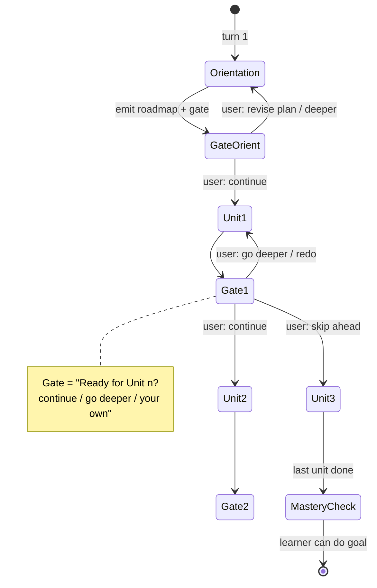
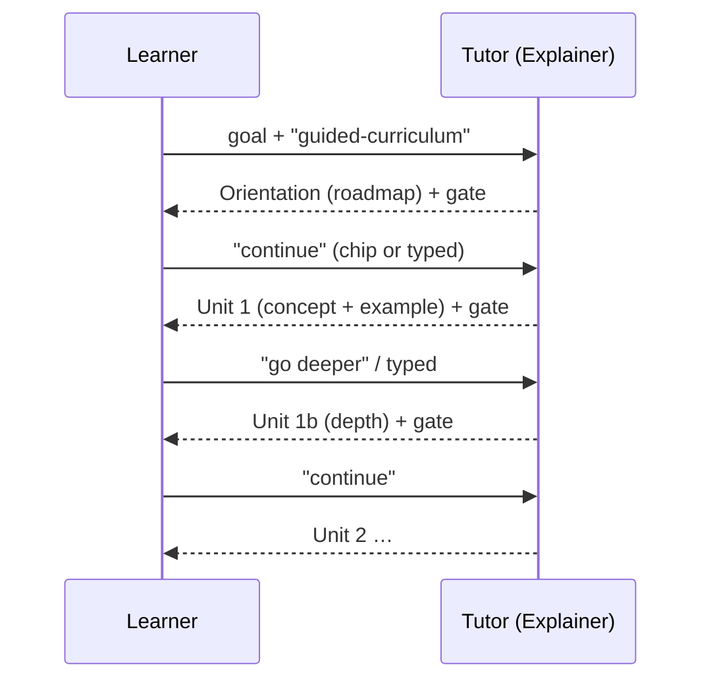
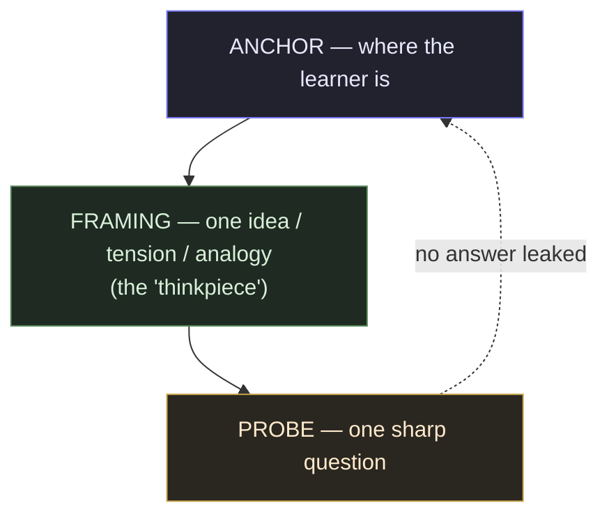
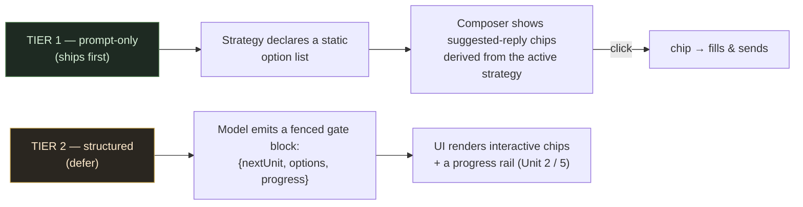
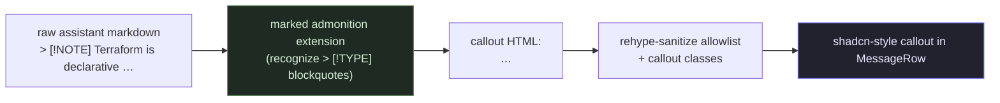

# Mayon — Learning Structure: Mode-Scoped Teaching Strategies

An architecture refinement of `refinement/architecture.md` and
`refinement/learning-brief-refinement.md`. Treat those as the authoritative
system design; this doc layers a **teaching-structure epic** on top of the
already-shipped Learning Brief.

> **Status: WHITEBOARD / PROPOSAL.** This is a design document for refinement.
> The phased build plan lands in `refinement/learning-structure-phased.md`
> **only after this design is approved.** Open questions are in §13.

---

## 1. The problem (as observed)

The Learning Brief (Phase A, shipped) calibrates *what* the tutor teaches
(`goal`, `level`, `context`) and picks a *style* (`mode`), but it does **not**
constrain *how the lesson is structured*. Today the mode contributes exactly
one sentence to the system prompt:

```ts
// src/lib/chat/brief.ts (as-shipped)
const MODE_INSTRUCTIONS: Record<BriefMode, string> = {
  socratic:  'prefer questioning and active recall over lectures',
  explainer: 'explain directly and clearly in your own words',
  build:     'work side-by-side with the learner, building toward the goal'
};
```

…and `scope` is a free-text string with no contract attached to it
(`"orient me in 10 min"`, `"mastery over days"`). The consequence is exactly
what is being observed:

| Mode       | Observed failure                                                                                       | Root cause                                                                       |
| ---------- | ------------------------------------------------------------------------------------------------------- | -------------------------------------------------------------------------------- |
| **Explainer** | Too short, **information density too low**, unpredictable structure; the lesson dumps or stalls.    | No curriculum contract: no overview, no units, no pacing gate, no density floor. |
| **Socratic**  | Replies too short; no nuance, no "thinkpiece" material. (Partly expected of the mode.)               | No skeleton that forces a substantive framing beat before the probe.             |
| **Build**     | Too little code; no copy-paste blocks; no side-knowledge ("Terraform is declarative…") callouts.     | No formatting contract: code is optional, no admonition convention is taught.    |

All three are the **same class of bug**: the tutor is told *what* to be, not
*how to structure its output*. Fixing this is a **prompt-engineering +
brief-shape** change, not a model change. The fix is a **mode-scoped teaching
strategy**: a predefined, selectable contract that tells the LLM the lesson's
structure, information density, pacing, and formatting.

---

## 2. Goals & non-goals

### Goals

1. **One predefined "scope" dropdown per mode** that selects a concrete
   teaching structure (the user's core ask).
2. **Information-density control** — output stops being unpredictably short or
   thin; each strategy declares a measurable density target.
3. **Explainer gets staged delivery**: an orientation/overview first, then
   chapter/section/phase delivery **gated** by an explicit
   *"proceed?"* prompt with selectable options (continue / type your own).
4. **Socratic gets substance**: keep the questioning posture, raise the floor
   on per-turn content (a real framing/"thinkpiece" beat before each probe).
5. **Build gets hands-on formatting**: copy-paste code blocks as first-class
   output, plus a **sparingly-used admonition** convention (`> [!NOTE]` /
   `[!WARNING]`) for genuine focus-pulls and gotchas, rendered as shadcn callouts.
6. **Zero architecture breakage**: everything routes through the existing
   `assembleContext` → `buildBriefSystemNote` chokepoint; branches inherit;
   labs/quizzes benefit for free.

### Non-goals (this epic)

- Changing the model or provider layer.
- Per-branch strategy overrides (branches inherit the root brief, by design).
- Server-side pacing state — the lesson is reconstructed from history each turn
  (statelessness is preserved; see §9).
- Mechanical output truncation/rewriting (we *instruct* density, we never
  post-process streaming tokens).

---

## 3. Core concept: the Scoping Strategy

A **Scoping Strategy** is a named, predefined contract that answers four
questions the tutor currently has to guess at:



- **Structure** — curriculum units (Explainer), inquiry turns (Socratic), build
  increments (Build).
- **Density** — a target word/depth band per unit, with a hard floor.
- **Pacing** — whether the tutor stops for a **gate** at the end of each unit,
  and what the gate options are.
- **Format** — code-first vs prose-first, and whether admonitions are in play.

The strategy is **selected at intake** (a dropdown that depends on the chosen
`mode`), stored on the root brief, inherited by branches, and rendered into the
system note — exactly the existing Learning Brief lifecycle. `scope` (free text)
is kept as an optional **refinement/budget override** layered on top
("orient me in 10 min" → tighter density, fewer units).

### Learning-science grounding

| Strategy lever     | Principle (named)                                                                                         | Why it maps                                                            |
| ------------------ | --------------------------------------------------------------------------------------------------------- | ---------------------------------------------------------------------- |
| Overview first     | **Advance organizers** (Ausubel) — a scaffold presented *before* detail improves retention & transfer.    | Explainer orientation/roadmap turn.                                    |
| Chunk into units   | **Cognitive load theory** (Sweller) — manage intrinsic load by segmenting.                                | Unit-per-turn structure across all modes.                              |
| Pacing gates       | **Learner control + formative checkpoints** (Black & Wiliam) — pauses reduce overload & enable retrieval. | Explainer/Build "proceed?" prompts.                                    |
| Density floor      | **Elaboration** (Craik & Lockhart) — deeper processing beats shallow one-liners.                          | Socratic thinkpiece beat; Explainer worked examples.                   |
| Substantive probes | **Maieutic / productive failure** (Kapur) — struggling toward an answer with rich framing deepens learning. | Socratic: never answer your own probe; let the learner attempt.        |
| Code-first build   | **Constructionism / cognitive apprenticeship** (Papert, Collins) + **worked-example fading** (Renkl).     | Build workshop: concrete runnable code → side-by-side → hand-off.      |
| Calibrate to level | **Zone of proximal development** (Vygotsky) — pitch just beyond current ability.                          | Density band + gate difficulty adapt to `level`.                       |

These are not decoration — each maps to a concrete directive in the strategy
block (§6) and to a measurable property (§10).

---

## 4. Data model (additive, non-breaking)

The brief gains one optional field: `scopeStrategy` — a **typed key** into a
per-mode registry. Free-text `scope` stays exactly as-is (a budget/refinement).

```ts
// src/lib/chat/brief.ts (proposed extension)
export type ScopeStrategyId =
  | 'guided-curriculum'   // Explainer default
  | 'deep-dive'
  | 'quick-orientation'
  | 'reference-manual'
  | 'guided-inquiry'      // Socratic default
  | 'devils-advocate'
  | 'case-based'
  | 'workshop'            // Build default
  | 'tutorial'
  | 'pair-programming';

export interface LearningBrief {
  goal: string;
  context?: string;
  level?: BriefLevel;
  mode?: BriefMode;
  scopeStrategy?: ScopeStrategyId;   // NEW — the dropdown pick
  scope?: string;                    // unchanged — free-text budget/refinement
}
```

**Why a typed key, not free text?** A key (a) makes the dropdown trivial,
(b) maps deterministically to a strategy block, and (c) is safe under
`parseBrief` (unknown/garbage → omitted → defaults). Free text can't give any
of those.

### Backward compatibility

- `parseBrief` already ignores unknown keys and rejects goal-less briefs. Adding
  `scopeStrategy` needs **one** validation line (`isScopeStrategy`) and a
  default-resolution step — **no migration, no schema change**. Old rows behave
  exactly as today (no strategy → mode default).
- `applyProfile` (Phase B) is extended to also seed a default `scopeStrategy`
  from the learner profile, with the same **brief > profile > default**
  precedence. Snapshot semantics are preserved.

### The registry

```ts
export interface ScopeStrategy {
  id: ScopeStrategyId;
  label: string;            // dropdown text, e.g. "Guided curriculum"
  hint: string;             // one-line "what you get"
  modes: BriefMode[];       // which modes offer this pick
  block: string;            // the prompt-engineering payload (see §6)
}
export const SCOPE_STRATEGIES: ScopeStrategy[] = [ /* … */ ];
export function strategiesForMode(m: BriefMode): ScopeStrategy[];
export function defaultStrategyFor(m: BriefMode): ScopeStrategyId;
```

| Mode        | Dropdown strategies                                              | Default             |
| ----------- | ---------------------------------------------------------------- | ------------------- |
| **Explainer** | Guided curriculum · Deep dive · Quick orientation · Reference manual | `guided-curriculum` |
| **Socratic**  | Guided inquiry · Devil's advocate · Case-based                   | `guided-inquiry`    |
| **Build**     | Workshop · Tutorial · Pair programming                           | `workshop`          |

---

## 5. Where it plugs in (zero new seams)

Everything the strategy needs already exists. `assembleContext` is the single
chokepoint for chat + labs + quizzes + grading, and it already calls
`buildBriefSystemNote`. The only change is that the **strategy block** replaces
today's one-line `MODE_INSTRUCTIONS`.



Files touched (small blast radius):

| File                                          | Change                                                                                             |
| --------------------------------------------- | -------------------------------------------------------------------------------------------------- |
| `src/lib/chat/brief.ts`                       | Add `ScopeStrategyId`, registry, `strategiesForMode`, `defaultStrategyFor`; extend `buildBriefSystemNote` to emit the strategy block; extend `applyProfile`. |
| `src/lib/components/chat/BriefCard.svelte`    | Add the **scope dropdown** (mode-dependent options) to intake + edit.                              |
| `src/lib/components/chat/LearnerProfileConfig.svelte` | Optional: default strategy in the profile.                                                 |
| `src/lib/chat/brief.test.ts`                  | Strategy resolution, registry lookup, snapshot precedence.                                         |

Labs/quizzes/grading get the new framing **for free** (no change to
`generate.ts` / `generate-quiz.ts`) — the lab will already follow the goal's
structure when the strategy says "units", because the strategy block tells it to.

---

## 6. The strategy block (the prompt-engineering payload)

This is the heart of the epic. Each `ScopeStrategy.block` is a concrete
directive string that replaces the one-liner. Below are the **default** block
drafts — these are the artifacts to refine together (§13).

### 6.1 Explainer — `guided-curriculum` (default)

The user's exact ask: **overview first → end by asking to proceed → then
section-by-section**, with options. This is staged delivery with pacing gates.

**Strategy block:**

```text
You teach in GUIDED CURRICULUM mode. Follow this structure strictly.

TURN 1 — ORIENTATION (always first, before any detail):
  • Lead with a 3–5 line advance organizer: what the goal is and why it matters.
  • Emit a TABLE OF CONTENTS of the 3–6 units that take the learner to the goal.
    Each unit line states the OUTCOME: "By Unit N you will be able to …".
  • Then STOP. Do not start Unit 1 yet. End with the pacing gate (below).

EACH UNIT — ONE PER TURN, self-contained and dense:
  1. Concept in your own words (no hand-waving, define every term on first use).
  2. At least one concrete example or worked instance tied to the learner's context.
  3. One line tying the unit back to the goal.
  • Density target: ~250–400 words per unit. Never under-fill a unit.

PACING GATE (end of EVERY unit and of the orientation):
  End the turn with exactly:
    "Ready for Unit <n>: <title>?  Reply **continue**, **go deeper**, or type your own direction."
  Never begin the next unit in the same turn. Never skip the gate.

Hard rules: never collapse the curriculum into a single long reply; never go
below the density target; when the learner can do the goal, say so and stop.
```

**Lifecycle (state machine):**



**Gate interaction (sequence):**



The "continue / go deeper / type your own" options are surfaced as
**suggested-reply chips** (§8) and are also valid as plain text — so the gate
works even with zero UI support.

### 6.2 Socratic — `guided-inquiry` (default)

Keep the questioning posture; **raise the substance floor** so turns are not
shallow one-liners. Each turn is a calibrated probe wrapped in a real
"thinkpiece" beat.

**Strategy block:**

```text
You teach in NUANCED INQUIRY mode. You are Socratic, but never terse or shallow.

EVERY TURN has exactly three parts, in order:
  1. ANCHOR (1–3 sentences): name the specific place the learner is in right now
     (their last attempt, the tension they hit). No generic restating.
  2. FRAMING (the thinkpiece): introduce ONE concept, tension, paradox, analogy,
     or contrast that re-frames the question. This beat must teach something
     substantive — a real idea, not filler. Use a short named concept where apt.
  3. PROBE: end with exactly ONE sharp question that forces reasoning toward the
     goal.

Hard rules:
  • Never answer your own probe. Never hand the learner the conclusion.
  • Density floor: ~120–250 words/turn. No one-line questions.
  • Adapt to ZPD: if the learner stalls twice on a probe, narrow it or offer a
    HINT (a branch to consider), not the answer.
  • Allow productive failure: invite an attempt before confirming correctness.
  • Use an occasional > [!CONCEPT] admonition ONLY for the single most pivotal
    idea of the whole exchange — never one per turn. Default to prose framing.
```

Anatomy of one Socratic turn (the floor this enforces):



### 6.3 Build — `workshop` (default)

Code-first, side-by-side, with **rarely-used admonitions** for the kind of
side-knowledge the user called out ("Terraform is declarative…") — a gotcha or a
definition that must pull focus.

**Strategy block:**

```text
You teach in WORKSHOP mode (build-together, hands-on).

EACH INCREMENT you deliver follows this anatomy:
  1. CONCEPT (1–3 lines): what we're adding and why, in plain words.
  2. CODE: a concrete, copy-pasteable fenced block — language-tagged and runnable.
     Prefer real code over pseudocode. Shell commands get their own fenced block.
  3. ADMONITION (SPARINGLY — see hard rules). Reserve a callout only for a
     phrase that MUST pull focus or a real gotcha/warning that explains nuance:
       > [!NOTE] Terraform is declarative — you describe desired state; the tool reconciles.
       > [!WARNING] Never commit the state file to git.
  4. WHY: one line connecting the increment to the goal.

Hard rules:
  • Lead with working code. Code blocks are first-class, not optional.
  • One increment per turn; then a gate: "Apply this, then say **next** (or paste the error)."
  • ADMONITIONS ARE RARE AND EARNED. At most ONE callout per ~4–5 paragraphs (or
    per increment). A callout must be either (a) a definition/claim that the
    learner must absolutely not miss, or (b) a warning/gotcha that prevents a
    subtle mistake or explains nuance. Definitions, ordinary tips, and
    shortcuts stay in normal prose — do NOT elevate them to callouts. If a
    turn would need two callouts, fold one into prose instead.
  • When the goal artifact is complete, summarize what was built and how to extend it.
```

Example Build turn (the shape this produces):

```markdown
### Step 2 — Add an S3 bucket

CONCEPT: we declare the bucket Terraform will manage. Terraform is **declarative**,
so you describe the *desired state* and the tool reconciles reality to match —
there's no "create" command, only `apply`.

```hcl
resource "aws_s3_bucket" "data" {
  bucket = "mayon-data-001"
}
```

> [!WARNING] The bucket name is **globally unique** across all of AWS. Change it
> before you `apply`, or the run will 409.

WHY: this is the state store our app will read/write. Apply it, then say
**next** (or paste the error).
```

---

## 7. Cross-cutting: the system note, reassembled

`buildBriefSystemNote` keeps its calibration lines and **appends the resolved
strategy block**. The assembled note:

```text
You are a personal learning tutor. Calibrate to this learner's brief:
- Goal: <goal>
- Level: <level>  · Context: <context>  · Mode: <mode>  · Scope: <scope>
- Structure: <strategy label>  (unless scope overrides the budget)

<STRATEGY BLOCK for the resolved strategy, verbatim>

Teach to the goal at the stated level; stay within scope.
When the learner can do the goal, say so.
```

- The **mode one-liner is removed** — it is now subsumed by the richer block.
- If `scope` sets an explicit budget ("orient me in 10 min"), an extra line
  tightens density/units; if it is empty, the strategy's defaults stand.
- Order inside `assembleContext` is unchanged: `[briefNote?, excerptNote?, …messages]`.

---

## 8. Pacing gates & suggested replies (UI surface)

The Explainer/Build gates need a way to send "continue / go deeper / next"
without typing. Two tiers — ship Tier 1 first, defer Tier 2:



**Tier 1 (recommended first phase):** the composer gains a row of
**suggested-reply chips**. The chip set is **static per strategy** (declared in
the registry: `guided-curriculum` → `["continue", "go deeper"]`; `workshop` →
`["next", "paste the error"]`; `guided-inquiry` → none, free-form only).
Clicking a chip fills and sends the composer. **No parsing of model output is
required** — the chips just send text the strategy block already knows how to
read. This alone makes the gate feel native.

**Tier 2 (later):** the model emits a tiny structured tail (a fenced `gate`
block with `nextUnit`, `options`, and a `progress` hint), parsed like the lab's
fenced JSON. The UI upgrades chips to be context-aware and shows a
**progress rail**. Strictly additive; Tier 1 keeps working if this is skipped.

### Statelessness (important)

The tutor reconstructs "where we are" from history each turn — there is **no
server-side lesson state**. The orientation turn and the gate prompts live in
the message history, so `assembleContext` already carries the lesson position.
This keeps branching/reference-based inheritance intact: a branch off Unit 2
inherits the curriculum up to that point.

---

## 9. Admonitions / callouts (markdown pipeline)

The Build strategy teaches `> [!NOTE]` syntax (GitHub Alerts). The renderer
must turn those into styled callouts. The pipeline already runs marked +
sanitize (`renderMarkdown`) with mermaid post-processing — admonitions fit the
same seam:



- **Recognized types:** `NOTE`, `TIP`, `WARNING`, `CONCEPT` (Socratic), `INFO`
  (Explainer orientation). Unknown types render as a neutral callout (never
  raw/broken).
- **Restraint is policy, not preference.** A callout is a focus-pull device —
  it only works because it's rare. Enforce:
  - **Frequency budget:** at most **one callout per ~4–5 paragraphs** (≈ one per
    Explainer unit / Build increment). Never back-to-back.
  - **Earned usage only:** a callout must be either (a) a definition/claim the
    learner *must not miss*, or (b) a **warning/gotcha** that prevents a subtle
    mistake or explains nuance. Ordinary tips, shortcuts, and routine
    definitions stay in prose.
  - **Downgrade rule:** if a turn would need two callouts, fold one into prose.
  - The strategy blocks (§6) opt each mode into this policy; none of them
    teaches "use callouts frequently".
- **Benefit is cross-mode:** Explainer roadmaps use `[!INFO]`; Socratic uses a
  single `[!CONCEPT]` for the pivotal idea; Build uses `[!NOTE]`/`[!WARNING]`
  for gotchas. Plain blockquotes are unaffected.
- The `Markdown.svelte` blockquote style already exists; callouts are a
  superset, so no visual regression for plain blockquotes.

---

## 10. Information-density model (making "not too short" testable)

Each strategy declares a **density contract** so quality is measurable, not
vibes:

| Strategy            | Structure skeleton (required parts)            | Word band/turn | Floor | Gate? |
| ------------------- | ---------------------------------------------- | -------------- | ----- | ----- |
| `guided-curriculum` | organizer + ToC · concept + example + tie-back | 250–400 (unit) | 250   | yes   |
| `quick-orientation` | organizer + 1 example per unit                 | 120–200        | 120   | yes   |
| `deep-dive`         | concept + 2 examples + edge cases + tie-back   | 450–700        | 450   | yes   |
| `guided-inquiry`    | anchor + framing + single probe                | 120–250        | 120   | no    |
| `workshop`          | concept + code + (≤1 earned admonition) + why | code-driven    | code+why | yes |
| `reference-manual`  | terse reference entries (table/list heavy)     | terse, lookup  | n/a   | no    |

- **Enforcement is prompt-driven, not mechanical.** We instruct the floor and
  skeleton in the block; we do not truncate or rewrite streaming tokens (that
  would corrupt partial markdown and break streaming UX).
- **Evaluation (optional, later):** a dev-only linter can score a sampled
  assistant turn against its declared skeleton (parts present? above floor?) to
  tune blocks — analogous to the P0 dev self-check.

---

## 11. Interaction with existing Learning Brief phases

- **Phase A (shipped):** unchanged contract; the mode one-liner is replaced by
  the richer block. The "byte-for-byte today's output" test is updated to assert
  the new block (this is an intentional behavior change, gated on a strategy
  being present).
- **Phase B (profile):** `applyProfile` gains `scopeStrategy` precedence
  (brief > profile > mode-default). Snapshot semantics hold.
- **Phase C (inferred brief):** `generate-brief` Zod schema gains an optional
  `scopeStrategy` so the inferred brief can propose a structure, not just a goal.
- **Labs/quizzes:** benefit for free via `assembleContext`; a strategy that says
  "units" makes the lab's steps align to those units.

---

## 12. Risks & edge cases

- **Prompt-token cost:** the block (~200–400 tokens) is added once per assembled
  context — negligible next to a conversation, consistent with the brief note.
- **Statelessness vs. "where are we":** lesson position is implicit in history.
  Long curricula could drift; the gate's `Unit <n>: <title>` recovers it each
  turn. Tier 2's structured progress rail is the durable fix if drift bites.
- **Streaming + gates:** a gate is just end-of-turn text — no streaming change.
  Tier 1 chips need no parse; Tier 2's fenced gate block is parsed on finish
  (like the lab fence), never mid-stream.
- **Density compliance:** models may still under-fill; the block's floor + the
  density model (§10) make this tunable and, later, measurable. We do **not**
  auto-extend replies (risk of gibberish); we tune the prompt.
- **Admonition portability:** GitHub-Alerts `> [!TYPE]` is widely understood by
  modern models; a fallback to plain blockquotes if a provider ignores it keeps
  output readable (sanitizer renders unknown as neutral callout).
- **Backward compat:** old briefs have no `scopeStrategy`; they resolve to the
  mode default and behave ~as today (only richer). No migration, no schema bump.
- **Branching:** strategies inherit with the brief (read from `rootId`); a
  mid-curriculum branch inherits the curriculum position from history.

---

## 13. Open questions (for your decision before the phased plan)

These are the design forks I want to lock with you before writing
`learning-structure-phased.md`:

1. **Dropdown shape.** Should the dropdown show only the **current mode's**
   strategies (3 each), or also let a strategy *imply* a mode (e.g. picking
   "Pair programming" auto-sets Build)? *Recommendation:* mode-scoped only —
   keep mode as the primary axis.
2. **Tier-1 chips default.** Always render suggested-reply chips for gated
   strategies, or hide behind a toggle? *Recommendation:* always on for gated
   strategies; they're inert if the user types instead.
3. **Admonition scope.** Ship the admonition renderer in the **first** phase
   (so Build lands correctly) or defer it? *Recommendation:* ship early — Build's
   core value depends on it, and it benefits all modes.
4. **Socratic "too short".** Confirm the goal is a **substance floor**
   (thinkpiece beat), *not* making Socratic lecture. The default
   `guided-inquiry` block raises the floor without breaking the mode.
5. **Density numbers.** Are the word bands in §10 the right targets, or do you
   want denser (especially Explainer `deep-dive` / Socratic framing)?
6. **Quick-orientation vs. reference-manual.** Keep both Explainer variants, or
   pare the dropdown to fewer options for v1?

---

## 14. Out of scope (future seams)

- Per-branch strategy overrides (branches inherit the root brief by design).
- Persistent lesson-state / resumable "course" objects (stateless reconstruction suffices).
- Adaptive difficulty engine beyond prompt-level ZPD hints.
- Spaced-repetition / mastery tracking against the strategy's units.
- Auto-generated visual course map beyond the orientation ToC.
