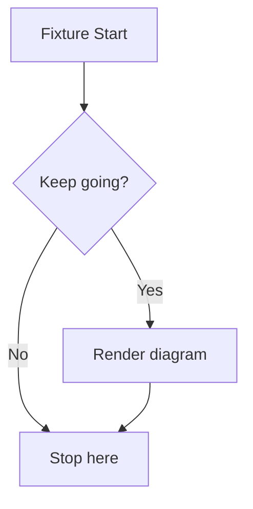

# The Kitchen-Sink Fixture

This document is the deterministic reply that the mock LLM serves to every chat request. The Mayon kitchen-sink fixture opens with this paragraph, and every renderer capability below sits at a known offset. Automated assertions read this text verbatim, so the words never change between runs.

## Markdown Structure

Structure is the cheapest rendering capability to assert, so it comes first.

- An unordered list with **bold**, _italic_, and `inline code` decoration
- A second item that mentions the [Mermaid docs](https://mermaid.js.org) used below
- A third item with no inline decoration at all

1. First ordered step of the deterministic reply
2. Second ordered step, which points at the table underneath
3. Third ordered step that closes the sequence

- [x] Ship one deterministic fixture document
- [ ] Extend it manually when a new renderer capability lands

| Capability | Marker in this document | Asserted by |
| ---------- | ----------------------- | ----------- |
| Headings   | the h2 above, h3 below  | structure   |
| Lists      | three lists above       | structure   |
| Table      | this table itself       | structure   |

### Nested Emphasis

> Blockquotes carry a quiet deterministic assertion: the quote body must render inside a blockquote element, set apart from the surrounding flow. This quote has two sentences so it is non-trivial to fake.

## Mathematics

Inline math such as $e^{i\pi}+1=0$ must render as KaTeX output, never as literal dollar text. The display form below must render as a KaTeX display block.

$$
\int_0^1 x^2 \, dx = \frac{1}{3}
$$

Both formulas travel through one math pipeline, so a regression there fails both assertions together.

## Diagram



The fence above must become a rendered diagram element, not a raw code block.

## Code

A Python block with more than one statement:

```python
def dominate(value: int) -> int:
    doubled = value * 2
    if doubled > 100:
        return doubled - 1
    return doubled + 1
```

A JavaScript block with more than one statement:

```javascript
export function summarize(rows) {
  const total = rows.reduce((acc, row) => acc + row.value, 0);
  return { count: rows.length, total };
}
```

Every fenced block carries a copy affordance injected by the renderer.

## Alignment Targets

Selection mapping needs prose that renders exactly as it is written. Alignment depends on stable plain sentences that render exactly as they are written. Every word here sits in one plain text node, with single spaces and no inline decoration.

The Mayon fixture closes with a second prose paragraph that also uses single spaces only. Deterministic offsets make expound branches reproducible, because the resolved excerpt always maps back to the same raw characters. Determinism is the whole point of this document.
